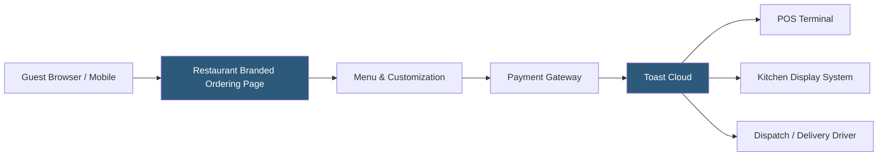

**Category:** Restaurant & Hospitality Hosting
**Difficulty:** Beginner
**Reading time:** 5 min read

---

Toast Online Ordering is a commission-free direct ordering channel embedded into a restaurant's own website, allowing guests to place pickup and delivery orders without relying on third-party marketplaces. Orders flow directly into the existing Toast POS, eliminating manual re-entry and reducing errors. Restaurants retain full control over branding, menu presentation, and customer data.

- **Commission-Free Ordering** — Direct channel with no per-order percentage fees to third-party platforms
- **Menu Sync** — Online menu automatically mirrors the POS menu configuration, including 86'd items and pricing
- **Dispatch Integration** — Connects with delivery service providers (DSPs) for last-mile fulfillment without marketplace fees
- **Order Throttling** — Controls the flow of incoming online orders to match kitchen capacity during peak periods
- **Guest Data Ownership** — Customer contact information and order history belong to the restaurant, not a marketplace
- **Upsell Prompts** — Configurable modifier and add-on suggestions during the online checkout flow

Toast Online Ordering provides restaurants a hosted ordering experience served from Toast's infrastructure under the restaurant's own domain or subdomain. The front-end menu is generated dynamically from the restaurant's POS menu configuration, so any changes made in the back office — new items, price adjustments, out-of-stock flags — propagate to the online menu automatically without manual updates.

When a guest submits an order, Toast processes the payment via its integrated payment stack (supporting credit cards, Apple Pay, and Google Pay) and injects the order directly into the POS as a takeout or delivery ticket. Operators can configure preparation time estimates, order throttling windows, and future-order scheduling. For delivery, Toast integrates with its own Dispatch network or third-party DSPs, routing orders to available drivers without requiring the restaurant to join a commission-based marketplace.

Analytics dashboards surface conversion rates, average order values, popular items, and revenue attributed to the online channel separately from in-person sales.

- Restaurants wanting to reduce dependency on high-commission platforms like DoorDash or Uber Eats
- Multi-location chains providing consistent branded ordering experiences
- Restaurants offering catering pre-orders with future scheduling
- Ghost kitchens operating exclusively through direct online ordering
- Quick-service restaurants reducing phone order volume

| Advantage | Disadvantage |
|-----------|--------------|
| No per-order marketplace commissions | Less discovery traffic than third-party platforms |
| Full customer data ownership | Requires marketing effort to drive direct traffic |
| Seamless POS integration eliminates re-entry | Limited customization of storefront design |
| Order throttling prevents kitchen overload | Delivery logistics require separate coordination |

- [Toast POS Restaurant Platform](toast-pos-restaurant-platform.md)
- [ChowNow Online Ordering](chownow-online-ordering.md)
- [Online Ordering Platform Hosting](online-ordering-platform-hosting.md)

---
*Part of the [Restaurant & Hospitality Hosting](index.md) category · [Back to Master Index](../../index.md)*
