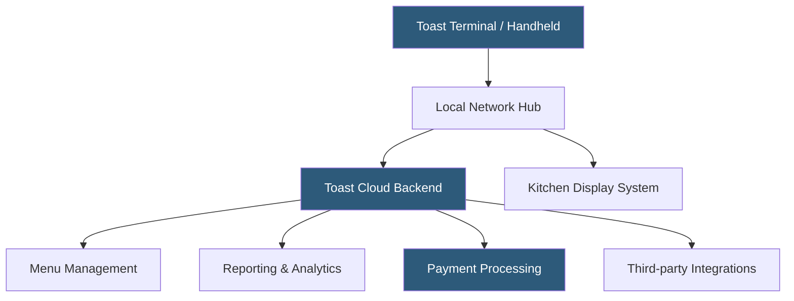

**Category:** Restaurant & Hospitality Hosting
**Difficulty:** Intermediate
**Reading time:** 6 min read

---

Toast is a cloud-based point-of-sale and restaurant management platform purpose-built for foodservice operations. It integrates hardware, software, and payments into a unified system designed to handle the demanding pace of restaurant environments. Toast runs on Android-based hardware and synchronizes orders, payments, and reporting in real time.

- **POS (Point of Sale)** — The system where transactions are processed, combining hardware terminals with software for order entry, payment, and reporting
- **Cloud Sync** — Real-time replication of transaction data to Toast's cloud infrastructure, enabling remote management and analytics
- **Toast Terminal** — Proprietary Android-based hardware terminals and handheld devices purpose-built for restaurant use
- **Menu Management** — Centralized control over menu items, modifiers, pricing, and availability pushed instantly to all terminals
- **Table Management** — Digital floor plan mapping table status, covers, and server assignments
- **Offline Mode** — Local processing capability that keeps operations running during internet outages, syncing when connectivity returns
- **Integrations Hub** — API connections to third-party services including delivery platforms, inventory, payroll, and marketing tools

Toast's architecture centers on Android-based terminals that communicate over the restaurant's local network while maintaining a persistent connection to Toast's cloud backend. Each terminal runs the Toast POS application locally, enabling offline processing if the internet connection drops — orders are queued and payments are accepted via card swipe with automatic sync resuming when connectivity is restored.

Orders entered at any terminal or via online ordering flow immediately to Kitchen Display Systems (KDS), which replace paper tickets and provide cook-time tracking. The cloud backend manages menu configuration, meaning a price change or 86'd item updates across all terminals within seconds.

Payment processing is handled natively through Toast Payments (or integrated third-party processors), with EMV chip, contactless NFC, and magnetic stripe support. End-of-day reporting aggregates sales by server, item, time period, and payment type. The Toast platform exposes REST APIs and webhooks enabling integrations with payroll systems like ADP, inventory platforms like MarketMan, and delivery aggregators like DoorDash. Data residency and PCI DSS compliance are managed by Toast's infrastructure team, reducing the compliance burden on restaurant operators.

- Full-service restaurants requiring table management, split bills, and course firing
- Quick-service restaurants needing fast order throughput and kitchen routing
- Multi-location restaurant groups managing centralized menus and reporting
- Ghost kitchens integrating online ordering with kitchen workflows
- Bars and breweries tracking tabs, pour sizes, and inventory

| Advantage | Disadvantage |
|-----------|--------------|
| Purpose-built hardware survives restaurant conditions (spills, drops) | Proprietary hardware creates vendor lock-in |
| Offline mode keeps operations running during outages | Monthly software fees add up for small operators |
| Unified payments, POS, and reporting in one platform | Contract terms can be restrictive |
| Strong ecosystem of 200+ integrations | Less customizable than open-source alternatives |
| Real-time menu updates across all terminals | Hardware replacement costs can be significant |

- [Toast Online Ordering](toast-online-ordering.md)
- [Kitchen Display System (KDS) Cloud](kitchen-display-system-kds-cloud.md)
- [Restaurant Analytics Platforms](restaurant-analytics-platforms.md)

---
*Part of the [Restaurant & Hospitality Hosting](index.md) category · [Back to Master Index](../../index.md)*
