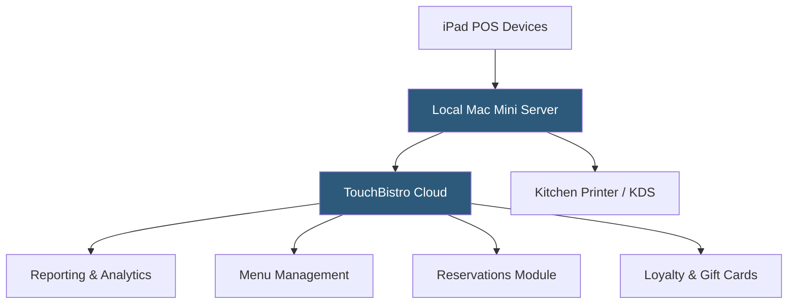

**Category:** Restaurant & Hospitality Hosting
**Difficulty:** Beginner
**Reading time:** 5 min read

---

TouchBistro is an iPad-based restaurant POS that combines cloud reporting with a locally-installed application, offering resilience against internet outages while maintaining centralized data management. Purpose-built for the restaurant industry, it covers front-of-house operations, staff management, and menu engineering within a single subscription. TouchBistro has expanded its platform to include reservations, gift cards, and loyalty programs.

- **Local-Cloud Hybrid** — Core POS runs locally on an in-restaurant Mac Mini server while reporting syncs to the cloud
- **TouchBistro Reservations** — Integrated reservation and waitlist management without third-party fees
- **Menu Engineering Reports** — Stars, plowhorses, puzzles, and dogs matrix analysis of menu item profitability
- **Staff Management** — Scheduling, role-based permissions, and tip pooling built into the platform
- **TouchBistro Payments** — Integrated payment processing with handheld card readers for tableside payments
- **VIP Guest Profiles** — Customer preference and visit history tracking linked to loyalty accounts

TouchBistro uses a hybrid architecture where a Mac Mini acts as the local server, allowing iPads to communicate over the restaurant's Wi-Fi network independently of internet connectivity. This design means the POS continues operating even if the internet connection drops, with cloud sync resuming automatically. The local server stores menus, transaction data, and employee records, while the cloud layer provides remote reporting access, software updates, and backup.

The platform's menu management supports multiple menus by time of day, complex modifier trees, and image-based menu displays for tableside ordering. Table management provides a configurable floor map with drag-and-drop seating. Kitchen printing and KDS routing send tickets to the appropriate stations based on item category.

TouchBistro's reservation module, added through acquisition, provides a guest-facing booking widget embeddable on the restaurant's website, with SMS confirmations and two-way messaging. The loyalty module tracks visit frequency, spend, and preferences, enabling targeted email campaigns. Menu engineering reports classify items by sales volume and profitability margin, guiding operators on what to promote or remove.

- Restaurants in areas with unreliable internet connections requiring local processing
- Full-service restaurants wanting integrated reservations without OpenTable fees
- Independent restaurants needing menu engineering analytics
- Multi-section venues (patio, bar, main dining) with complex floor layouts
- Operators building guest loyalty programs within their existing POS

| Advantage | Disadvantage |
|-----------|--------------|
| Local server ensures operation during internet outages | Mac Mini server requires on-site hardware maintenance |
| Strong menu engineering and analytics tools | More complex setup than pure cloud platforms |
| Integrated reservations reduces third-party dependencies | Higher upfront hardware investment |
| Tableside ordering via iPad handhelds | Limited third-party integration ecosystem |

- [Toast POS Restaurant Platform](toast-pos-restaurant-platform.md)
- [OpenTable Reservation Platform](opentable-reservation-platform.md)
- [Restaurant Reservation Systems](restaurant-reservation-systems.md)

---
*Part of the [Restaurant & Hospitality Hosting](index.md) category · [Back to Master Index](../../index.md)*
