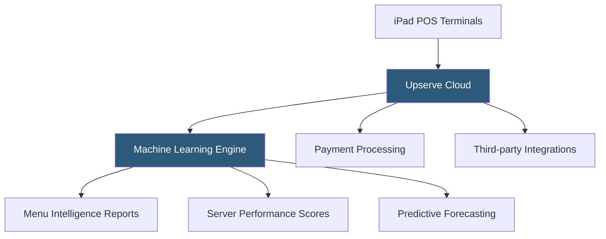

**Category:** Restaurant & Hospitality Hosting
**Difficulty:** Intermediate
**Reading time:** 6 min read

---

Upserve, now integrated into Lightspeed Restaurant, was a pioneering restaurant intelligence platform that combined POS functionality with advanced data analytics, server coaching, and predictive insights. The platform introduced machine-learning-driven recommendations for menu optimization and staff performance, distinguishing it from transactional POS systems. Its analytics DNA is now central to Lightspeed Restaurant's reporting capabilities.

- **Restaurant Intelligence** — Machine learning analysis of sales patterns to surface actionable insights automatically
- **Server Performance Coaching** — Per-server metrics on upsell rate, table turn time, and guest satisfaction scores
- **Predictive Sales Forecasting** — AI-powered forecasting of expected covers and revenue based on historical data and external signals
- **Offline Mode** — Full POS functionality maintained during internet outages with local data storage
- **Upserve Payments** — Integrated EMV and NFC payment processing with interchange-plus pricing
- **Breadcrumb POS** — The iPad-based POS application acquired and rebranded from Breadcrumb by Groupon

Upserve's platform collected granular transaction data — every item ordered, modification made, time to table, payment method, and server — and ran this through proprietary machine learning models. The resulting insights surfaced automatically in manager dashboards: which menu items are underperforming relative to their cost, which servers consistently upsell, and what days historically see demand spikes.

The predictive forecasting engine ingested weather data, local events, and historical reservation patterns to project daily covers and suggested staffing levels, reducing both overstaffing costs and understaffing service failures. Server coaching dashboards provided each team member visibility into their own performance metrics, gamifying sales performance.

Following Lightspeed's acquisition in 2021, Upserve's technology was merged into Lightspeed Restaurant, bringing its analytics depth to Lightspeed's broader platform. Existing Upserve customers were migrated to Lightspeed Restaurant while retaining access to the intelligence features that differentiated the platform.

- Data-driven restaurant operators focused on labor cost optimization
- Groups using server performance data for targeted coaching and incentive programs
- Restaurants with complex menus needing automated menu engineering analysis
- Operators wanting predictive staffing recommendations
- High-volume restaurants where marginal efficiency improvements compound significantly

| Advantage | Disadvantage |
|-----------|--------------|
| Industry-leading analytics and server intelligence | Now subsumed into Lightspeed, losing standalone identity |
| Predictive forecasting reduces labor waste | Higher price point than basic POS platforms |
| Automated insights reduce manual reporting work | Requires sufficient data volume for ML models to be accurate |
| Strong offline mode reliability | Transition to Lightspeed introduced some feature adjustments |

- [Lightspeed Restaurant POS](lightspeed-restaurant-pos.md)
- [Restaurant Analytics Platforms](restaurant-analytics-platforms.md)
- [Toast POS Restaurant Platform](toast-pos-restaurant-platform.md)

---
*Part of the [Restaurant & Hospitality Hosting](index.md) category · [Back to Master Index](../../index.md)*
