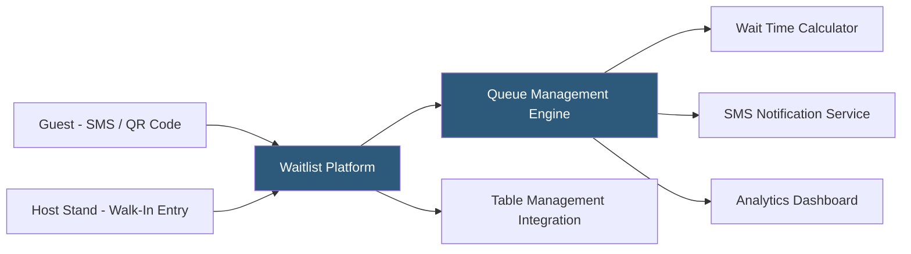

**Category:** Restaurant & Hospitality Hosting
**Difficulty:** Beginner
**Reading time:** 5 min read

---

Waitlist management platforms replace physical wait lists and pager systems with digital queues that notify guests via SMS when their table is ready. They eliminate guests having to wait inside or within earshot of the restaurant, improving the guest experience while freeing lobby space. Cloud-hosted waitlist platforms also provide operators with queue analytics, no-show tracking, and integration with table management and reservation systems.

- **Virtual Queue** — Digital waitlist allowing guests to join from their phone before arriving at the restaurant
- **SMS Notifications** — Automated text messages providing queue position updates and table-ready alerts
- **Estimated Wait Time** — Dynamically calculated wait estimates based on current queue depth and historical turn times
- **Guest Self-Management** — Allow guests to confirm they're on their way, delay their seating, or remove themselves from the queue
- **Walk-In Intake** — Rapid party addition with name, party size, and phone number capture at the host stand
- **Waitlist Analytics** — Reporting on average wait times, no-show rates, and peak demand periods

Waitlist platforms provide two intake channels: guests can join remotely by scanning a QR code posted at the restaurant entrance or on the website, or hosts can add walk-in parties manually at the host stand interface. Both flows capture party name, size, and contact phone number. The system displays the guest's estimated wait and their position in the queue.

The wait time calculator estimates based on historical turn time data for similar party sizes during this service period, adjusting in real time as parties are seated faster or slower than the average. As groups ahead of the party are seated and tables become available, the system calculates when the guest's table should be ready and proactively sends status updates.

When a table is ready, the host selects the next appropriate party from the queue, triggering an SMS notification to the guest and starting a countdown clock. If the guest doesn't respond within a configurable window, the platform alerts the host and may advance to the next party. No-show rates are tracked for analysis, informing whether holds or deposits should be implemented during high-demand periods.

- High-traffic restaurants that don't accept reservations
- Casual dining chains reducing physical lobby crowding
- Restaurants offering a hybrid model of reservations and walk-in queuing
- Food halls and markets with shared dining space
- Event venues managing simultaneous large groups

| Advantage | Disadvantage |
|-----------|--------------|
| Guests can wait comfortably rather than in crowded lobbies | SMS carrier reliability affects notification delivery |
| Reduces perceived wait time through active engagement | Requires guests to have smartphones and SMS access |
| Queue analytics inform staffing and reservation policy decisions | No-show risk is higher than traditional pager systems |
| Integrates with table management for seamless flow | Setup and training investment for host staff |

- [Table Management Systems](table-management-systems.md)
- [Restaurant Reservation Systems](restaurant-reservation-systems.md)
- [OpenTable Reservation Platform](opentable-reservation-platform.md)

---
*Part of the [Restaurant & Hospitality Hosting](index.md) category · [Back to Master Index](../../index.md)*
