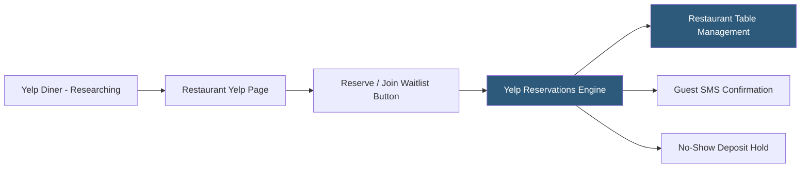

**Category:** Restaurant & Hospitality Hosting
**Difficulty:** Beginner
**Reading time:** 5 min read

---

Yelp Reservations (formerly SeatMe) allows restaurants to accept table bookings directly through Yelp's consumer platform, capturing intent-driven diners who are already researching the restaurant. The integration connects Yelp's massive review and discovery traffic to the reservation workflow, converting engaged users into confirmed guests without requiring them to navigate away. Yelp Waitlist additionally enables walk-in queue management visible to nearby guests.

- **Yelp Reservations** — Booking widget integrated directly into the restaurant's Yelp business page
- **Yelp Waitlist** — Real-time waitlist display showing current estimated waits, allowing guests to join remotely
- **Intent-Driven Bookings** — Reservations captured at the point of consumer research, improving conversion
- **SeatMe Integration** — The underlying table management technology Yelp acquired and integrated
- **No-Show Protection** — Credit card hold capability to reduce reservation abandonment
- **Yelp Guest Manager** — Consolidated front-of-house platform combining reservations, waitlist, and table management

When a diner searches for a restaurant on Yelp and finds the listing page, Yelp Reservations displays a booking widget showing available time slots in real time. This captures reservation intent at the moment of research, which historically converts at higher rates than requiring the user to navigate to a separate booking site. The Yelp Waitlist feature displays current estimated wait times for walk-ins, and nearby diners can join the digital queue before arriving.

The underlying Guest Manager platform manages the restaurant's floor map, table assignments, and covers in a similar fashion to dedicated reservation systems. Operators configure pacing rules, party size limits, and available time slots through the management portal. Post-dining, Yelp's review ecosystem captures guest feedback automatically as part of the broader Yelp review platform.

Yelp's pricing for Reservations is structured as a flat monthly subscription for smaller restaurants, with enterprise packages for multi-location operators. The no-show protection feature allows restaurants to require a credit card on file, charged if the guest cancels within a defined window or does not appear.

- Restaurants with strong Yelp presence wanting to convert profile visitors to reservations
- Casual dining operators managing walk-in heavy crowds with digital waitlists
- Restaurant districts where Yelp is the primary consumer research tool
- Operators wanting a single subscription covering reservations and the review presence they already pay for
- Restaurants using no-show deposits to reduce revenue loss from unfilled tables

| Advantage | Disadvantage |
|-----------|--------------|
| Captures bookings directly from Yelp's active research audience | Less comprehensive table management than OpenTable or Resy |
| Reduces platform navigation friction for Yelp users | Yelp's influence varies significantly by market and cuisine type |
| Waitlist visibility drives incremental walk-in traffic | Review dependency can create conflict of interest perceptions |
| Consolidated subscription with Yelp presence tools | Integration options with POS systems more limited |

- [OpenTable Reservation Platform](opentable-reservation-platform.md)
- [Resy Reservation Hosting](resy-reservation-hosting.md)
- [Waitlist Management Hosting](waitlist-management-hosting.md)

---
*Part of the [Restaurant & Hospitality Hosting](index.md) category · [Back to Master Index](../../index.md)*
