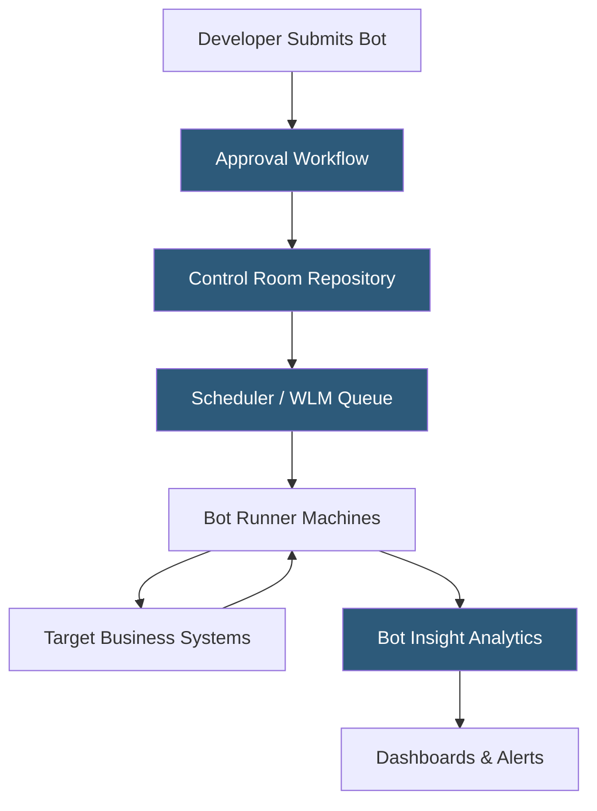

**Category:** RPA (Robotic Process Automation)
**Difficulty:** Intermediate
**Reading time:** 6 min read

---

The Automation Anywhere Control Room is the centralized management, governance, and analytics hub for the Automation Anywhere platform. Available as a cloud SaaS or on-premises deployment, it provides role-based access control, bot lifecycle management, scheduling, workload queuing, audit logging, and real-time bot performance dashboards across the entire automation program.

- **Bot Lifecycle** — the stages a bot moves through from development, testing, and approval to production deployment
- **Role-Based Access Control (RBAC)** — a permission system assigning Control Room capabilities to users based on defined roles
- **Credential Vault** — an encrypted store for credentials and API keys injected into bots at runtime
- **Workload Management (WLM)** — a queue-based system distributing work items across Bot Runner machines dynamically
- **Bot Insight** — the analytics module providing real-time dashboards on bot performance, SLA compliance, and exception rates
- **Approval Workflow** — a configurable change control process requiring sign-off before bots deploy to production
- **Auto-Scale** — an Automation Anywhere feature dynamically provisioning Bot Runners on cloud infrastructure based on queue depth

Control Room is the hub that all Automation Anywhere components connect to. Bot Agents installed on runner machines establish persistent TLS connections to Control Room and authenticate using machine-level credentials. Bot Creators (developers) authenticate via SSO or local accounts and interact with Control Room through the web interface.

The bot lifecycle management system tracks each bot from initial check-in through QA testing to production deployment. Change control workflows require designated approvers (QA leads, automation managers) to review and approve bots before production promotion, with full audit trails of who approved what and when.

Workload Management operates as a priority queue. Transaction items (invoice records, order IDs, employee IDs) are added by feeder processes or external API calls. Control Room assigns items to available Bot Runners using configurable priority and round-robin logic, automatically retrying failed items based on configured retry counts.

Bot Insight (now integrated into the main Control Room analytics module in Automation 360) provides real-time dashboards. Teams monitor bot utilization rates, queue depths, average processing time per transaction, exception rates by error type, and ROI metrics calculating hours saved against robot cost. SLA monitoring alerts notify teams when queue depths exceed thresholds indicating backlog buildup.

- Enterprise governance of automation programs across multiple business units
- High-volume queue processing across large Bot Runner fleets
- Compliance audit trails for regulated process automation
- ROI measurement and executive reporting on automation value
- Change management for automation development and deployment

| Advantage | Disadvantage |
|-----------|--------------|
| Centralized governance ensures bot quality and compliance | Complex migration from on-premises v11 to Automation 360 cloud |
| WLM enables elastic scaling across Bot Runner fleets | On-premises deployment requires dedicated infrastructure team |
| Bot Insight provides actionable performance analytics | Advanced analytics features require additional licensing |
| Cloud Control Room eliminates self-managed infrastructure | Internet dependency for cloud deployments in high-security environments |

- [Automation Anywhere Platform](automation-anywhere-platform.md)
- [UiPath Orchestrator](uipath-orchestrator.md)
- [RPA Governance Frameworks](rpa-governance-frameworks.md)

---
*Part of the [RPA (Robotic Process Automation)](index.md) category · [Back to Master Index](../../index.md)*
