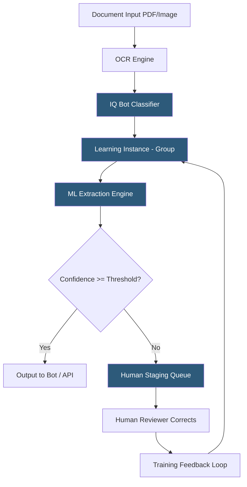

**Category:** RPA (Robotic Process Automation)
**Difficulty:** Advanced
**Reading time:** 6 min read

---

IQ Bot is Automation Anywhere's intelligent document processing solution that uses cognitive AI to extract data from semi-structured documents like invoices, purchase orders, bank statements, and forms. It combines OCR, natural language processing, and machine learning to understand document layouts and extract field values with human-level accuracy after sufficient training.

- **Learning Instance** — a trained model in IQ Bot specific to a document type and layout group
- **Staging** — the human validation phase where extracted data is reviewed and corrected to generate training samples
- **Group** — a cluster of similar document layouts within an IQ Bot learning instance, each with its own extraction model
- **Field** — a named data element to extract (Invoice Number, Total Amount, Vendor Name) defined in the document taxonomy
- **Confidence Threshold** — the minimum extraction confidence score required for automatic processing without human staging
- **Bot Integration** — an API or Bot package connector enabling Automation Anywhere bots to submit documents to IQ Bot and retrieve results
- **Auto-Routing** — automatic document classification and routing to the correct learning instance without manual triage

IQ Bot processes documents through a pipeline of cognitive services. When a document arrives (via folder watch, Bot submission, or API), an OCR engine digitizes it. Automation Anywhere integrates with multiple OCR providers (Tesseract, ABBYY, Google Vision, Azure Form Recognizer), selecting the optimal engine based on document characteristics.

The classifier assigns the document to a learning instance based on content signals—layout patterns, keyword presence, and structural features. Within a learning instance, documents cluster into groups representing similar layout variants (e.g., three different vendor invoice templates for the same company).

The ML extraction engine applies a trained model to identify field values within the document. Models use a combination of anchoring (finding a label near a value), positional reasoning (the amount is always in the bottom-right of the table), and text pattern matching (invoice numbers match [A-Z]{2}\d{6} pattern). Each extracted field returns a confidence score.

Documents with all fields above the confidence threshold proceed automatically. Documents with any field below threshold enter the staging queue, where human reviewers see the document with extracted values highlighted. Corrections entered in the staging interface become training samples, which feed a periodic model retraining cycle.

- Automated invoice processing for accounts payable
- Bank statement reconciliation for finance teams
- Customs declaration document processing
- Healthcare explanation of benefits (EOB) processing
- Purchase order matching in procurement workflows

| Advantage | Disadvantage |
|-----------|--------------|
| Handles layout variations other RPA cannot process | Requires substantial training data for custom document types |
| Continuous learning reduces staging workload over time | OCR quality significantly impacts extraction accuracy |
| Integrates natively with Automation Anywhere bot workflows | Higher operational cost per page vs. structured data processing |
| Auto-routing eliminates manual document sorting | Staging bottlenecks develop if accuracy thresholds set too high |

- [Automation Anywhere Platform](automation-anywhere-platform.md)
- [UiPath Document Understanding](uipath-document-understanding.md)
- [Blue Prism Decipher IDP](blue-prism-decipher-idp.md)

---
*Part of the [RPA (Robotic Process Automation)](index.md) category · [Back to Master Index](../../index.md)*
