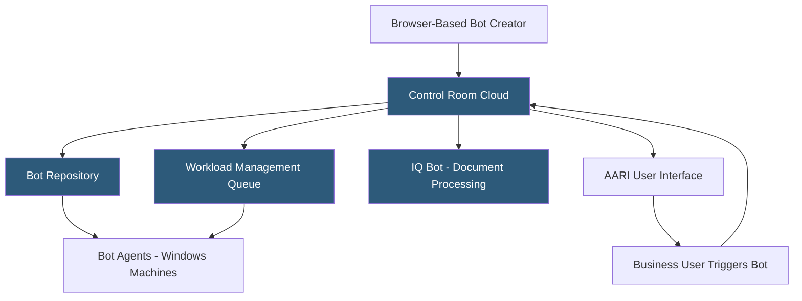

**Category:** RPA (Robotic Process Automation)
**Difficulty:** Intermediate
**Reading time:** 7 min read

---

Automation Anywhere is a cloud-native intelligent automation platform combining RPA, AI, and analytics in a web-based architecture. Its flagship product, Automation 360, runs entirely in the cloud with a browser-based bot development environment, eliminating the need for local IDE installations and enabling collaborative bot development across distributed teams.

- **Bot** — Automation Anywhere's term for an RPA automation, equivalent to a robot/workflow in other platforms
- **Control Room** — the cloud or on-premises management console for deploying, scheduling, and monitoring bots
- **Bot Creator** — a web-based bot development environment accessed via browser without local software installation
- **AARI (Automation Anywhere Robotic Interface)** — a UI layer enabling business users to interact with automation via web, desktop, or Slack
- **IQ Bot** — the intelligent document processing component using ML for unstructured document extraction
- **Bot Agent** — a lightweight desktop agent installed on machines that execute bots under Control Room direction
- **Workload Management** — a queue-based system distributing bot execution across available Bot Runners

Automation Anywhere's Automation 360 platform is delivered as a cloud SaaS application. Bot developers access the Bot Creator through a web browser, building automation logic using a drag-and-drop action library without installing local software. This reduces IT provisioning friction and enables development from any machine with browser access.

Bots are composed of Actions—pre-built automation steps organized in packages (Browser package, Excel Basic package, REST Web Service package). Developers chain actions in a sequential or conditional flow, configure variables, and use recorder tools to capture UI interactions. The web recorder captures web browser interactions using CSS selectors, while the object cloning method captures thick-client Windows application elements.

Control Room manages the automation lifecycle. Bots are stored in a repository with version control, deployed to Bot Agent-equipped machines, and scheduled via triggers (time-based, API, or queue-driven). Workload Management distributes queue items across available Bot Runners, automatically load-balancing work without manual allocation.

AARI provides a human-automation collaboration layer. Business users access AARI through a web portal or Slack integration to trigger bots, submit data, complete human review tasks within automated workflows, and view bot status. This enables non-technical users to initiate and participate in automation without Orchestrator access.

The platform supports multi-cloud deployment across AWS, Azure, and GCP, with data residency controls for regulated industries.

- Accounts payable and receivable process automation
- IT service desk ticket processing and resolution
- HR data sync across HRIS, Active Directory, and benefits systems
- Sales order processing and CRM data entry
- Compliance reporting across multiple regulatory systems

| Advantage | Disadvantage |
|-----------|--------------|
| Browser-based development eliminates local IDE setup | Web-based IDE has performance limitations vs. desktop Studio |
| Cloud-native architecture simplifies infrastructure | Control Room migration from v11 to A360 has high complexity |
| AARI enables business user participation in automation | Bot Agent still requires Windows machine installation |
| Strong enterprise security certifications | Pricing model complexity with community vs. enterprise tiers |

- [Automation Anywhere IQ Bot](automation-anywhere-iq-bot.md)
- [Automation Anywhere Control Room](automation-anywhere-control-room.md)
- [UiPath Automation Platform](uipath-automation-platform.md)

---
*Part of the [RPA (Robotic Process Automation)](index.md) category · [Back to Master Index](../../index.md)*
