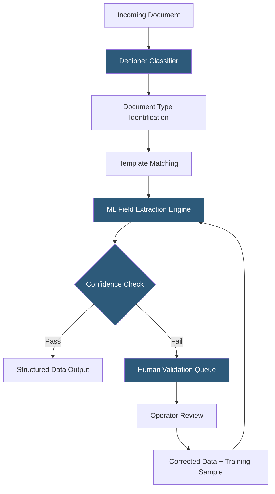

**Category:** RPA (Robotic Process Automation)
**Difficulty:** Advanced
**Reading time:** 6 min read

---

Blue Prism Decipher is an Intelligent Document Processing (IDP) solution natively integrated with the Blue Prism platform, enabling automated extraction of data from unstructured and semi-structured documents. It uses computer vision and machine learning to identify document types, locate field values, and achieve straight-through processing for document-heavy back-office workflows.

- **Document Classification** — automatically identifying the type of an incoming document (invoice, contract, ID document) before extraction
- **Field Extraction** — identifying and capturing the value of a named field (invoice date, total amount) from the document image
- **Extraction Confidence** — a per-field score indicating model certainty; low-confidence fields route to human validation
- **Document Template** — a layout definition configuring which fields to extract and where to find them for a specific document type
- **Human Validation** — a queue interface where operators review and correct low-confidence extractions
- **Supervised Learning** — model improvement through training on operator-corrected extraction samples
- **Blue Prism Integration** — native Business Objects enabling Blue Prism processes to submit documents and receive extracted data

Decipher operates as a hosted service within a Blue Prism deployment (cloud or on-premises). Documents arrive through a monitored folder, email attachment listener, or Blue Prism process submission. The classification engine analyzes document structure and content to assign a document type, routing it to the appropriate extraction template.

Document templates define the fields to extract and configure the extraction strategy per field. Decipher supports multiple extraction strategies: anchor-based (find the label "Invoice Number:" and extract the adjacent value), zone-based (extract from a fixed position on a known document layout), table extraction (parse tabular line items into structured rows), and contextual extraction (use surrounding text context to identify values in variable-position documents).

Extraction results include per-field confidence scores. Organizations configure confidence thresholds by field type—financial fields might require 0.95 confidence for automatic processing while reference number fields accept 0.80. Documents or fields below threshold appear in the validation queue, where operators review the document image alongside extracted values and make corrections.

Blue Prism processes interact with Decipher through native Business Objects. A process submits a document file path, waits for or polls extraction completion, retrieves structured field values as a data collection, and continues processing—entering values into SAP, posting to an API, or updating a database record.

- Accounts payable invoice processing with vendor invoice variations
- Trade finance document processing (letters of credit, bills of lading)
- Insurance policy document extraction for underwriting workflows
- Mortgage origination document processing
- KYC (Know Your Customer) document extraction for compliance

| Advantage | Disadvantage |
|-----------|--------------|
| Native Blue Prism integration eliminates middleware | Lower market awareness than ABBYY or UiPath solutions |
| Continuous learning from validation improves over time | Requires significant labeled training data for custom types |
| On-premises deployment supports data sovereignty requirements | Higher implementation effort vs. cloud-native IDP services |
| Template-based approach works well for consistent formats | Complex tables and handwritten content challenge accuracy |

- [Blue Prism Intelligent Automation](blue-prism-intelligent-automation.md)
- [UiPath Document Understanding](uipath-document-understanding.md)
- [Automation Anywhere IQ Bot](automation-anywhere-iq-bot.md)

---
*Part of the [RPA (Robotic Process Automation)](index.md) category · [Back to Master Index](../../index.md)*
