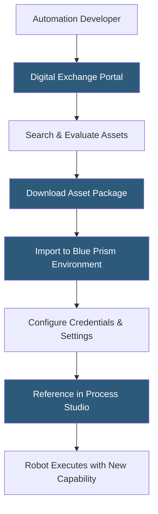

**Category:** RPA (Robotic Process Automation)
**Difficulty:** Intermediate
**Reading time:** 5 min read

---

The Blue Prism Digital Exchange (DX) is a marketplace of certified automation assets including pre-built Business Objects, API connectors, cognitive skills, and partner solutions that extend Blue Prism's capabilities. It provides a curated library of reusable components allowing automation teams to integrate third-party services without building connectors from scratch.

- **Digital Worker Skill** — a packaged automation capability that can be downloaded and imported into a Blue Prism environment
- **Cognitive Skill** — a DX asset wrapping an AI service (OCR, NLP, computer vision) as a reusable Blue Prism action
- **API Connector** — a pre-built Business Object providing authenticated access to third-party service APIs
- **Technology Alliance Partner** — a certified Blue Prism partner whose products appear on the DX with verified compatibility
- **Asset Rating** — a community quality score helping teams evaluate assets before adoption
- **Release Compatibility** — DX assets are tagged with compatible Blue Prism versions to prevent deployment on incompatible environments
- **Free vs. Commercial Assets** — DX hosts both freely downloadable community assets and commercially licensed partner solutions

The Digital Exchange operates as a web portal where Blue Prism users browse, evaluate, and download automation assets. Assets are packaged as Blue Prism release files (.bprelease) containing Business Objects, processes, or complete automation solutions. After downloading, developers import packages into their Blue Prism environment through the File > Import menu, which installs the Business Objects and any associated configuration.

Cognitive skill assets typically wrap external AI APIs—Google Cloud Vision for image recognition, AWS Comprehend for sentiment analysis, OpenAI for text generation. Each skill asset includes a pre-configured Business Object with actions calling the external API, and documentation for configuring API credentials as Blue Prism credentials.

Technology Alliance Partners certify their Blue Prism integrations and list them on the DX with compatibility matrices, support contacts, and licensing terms. Examples include ABBYY FlexiCapture integration for document processing, Pega connector for case management, and ServiceNow integration for IT service management.

The community contribution model allows Blue Prism customers and partners to submit assets for DX listing after passing a basic compatibility review. Community assets are marked as untested by Blue Prism but provide a starting point teams can adapt.

- Rapidly integrating Salesforce, SAP, or ServiceNow without building connectors
- Adding OCR and document processing to automations via cognitive skills
- Accessing partner-built industry-specific automation templates
- Sharing internally developed Business Objects with the broader community
- Evaluating third-party AI services via pre-built Blue Prism wrappers

| Advantage | Disadvantage |
|-----------|--------------|
| Reduces development time for common integrations | Asset quality varies significantly between community contributors |
| Partner-certified assets include support agreements | Commercial assets add licensing cost on top of Blue Prism platform |
| Cognitive skills make AI accessible without ML expertise | Assets may lag behind third-party API versions |
| Version compatibility tagging prevents incompatibility issues | Smaller asset library than UiPath Marketplace |

- [Blue Prism Intelligent Automation](blue-prism-intelligent-automation.md)
- [Blue Prism Decipher IDP](blue-prism-decipher-idp.md)
- [UiPath Automation Platform](uipath-automation-platform.md)

---
*Part of the [RPA (Robotic Process Automation)](index.md) category · [Back to Master Index](../../index.md)*
