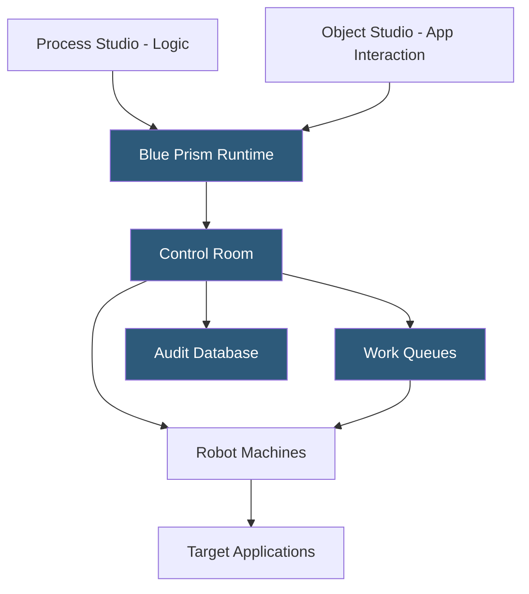

**Category:** RPA (Robotic Process Automation)
**Difficulty:** Intermediate
**Reading time:** 7 min read

---

Blue Prism is a mature enterprise RPA platform known for its robust governance model, visual process studio, and object-based design philosophy that separates process logic from application interaction. Now part of SS&C Technologies, Blue Prism targets regulated industries—banking, insurance, healthcare, and government—where audit compliance, security, and resilience are paramount.

- **Process Studio** — the Blue Prism visual designer for building automation logic using flowchart-based diagrams
- **Object Studio** — the component where application interaction logic is encapsulated, separate from process logic
- **Business Object** — a reusable application interface definition containing actions that interact with a specific application
- **Application Modeller** — the tool used to spy UI elements and configure application modes (accessibility, HTML, region)
- **Control Room** — the Blue Prism scheduler and monitoring interface for managing robot queues and schedules
- **Work Queue** — a database-backed queue of work items that robots process, with built-in retry and exception management
- **Digital Exchange (DX)** — Blue Prism's marketplace of pre-built connectors, skills, and certified third-party integrations

Blue Prism's design philosophy centers on separating concerns. Process Studio handles business logic—the sequence of steps, decisions, and data transformations in a process. Object Studio handles application interaction—how to open an application, navigate screens, read and write data. A Business Object encapsulates all interaction with a specific application (e.g., SAP GUI, a web portal) into reusable action pages, while Process Studio calls these objects by name without knowing their implementation details.

This architecture makes automations more maintainable: when an application UI changes, developers update the Business Object once rather than modifying multiple processes. The Application Modeller spies on running applications to identify UI elements using multiple detection modes—Win32 accessibility, HTML attributes, image region, or surface automation for stubborn applications.

All Blue Prism automations run unattended—there is no native attended robot concept in traditional Blue Prism. Robots connect to the Blue Prism database through SQL Server, fetching work items from queues and writing results back. The Control Room provides schedules, queue management, and real-time dashboards showing robot utilization and exception rates.

The Blue Prism database serves as both the configuration store and operational audit log. Every action a robot takes writes a log entry to the database, providing a tamper-evident audit trail. This design satisfies compliance requirements in banking and insurance but creates a database performance bottleneck at very high transaction volumes.

- Regulated banking processes requiring immutable audit trails
- Insurance claims processing with multi-system integration
- Government agency back-office automation with strict security requirements
- Healthcare data reconciliation across disparate clinical systems
- Utility company billing and payment processing

| Advantage | Disadvantage |
|-----------|--------------|
| Strongest governance and audit trail in enterprise RPA | Steeper developer learning curve than UiPath or AA |
| Object separation makes automations more maintainable | Database-centric architecture limits very high throughput |
| Proven in highly regulated industries for 20+ years | Higher infrastructure requirements (SQL Server dependency) |
| Digital Exchange provides certified integration marketplace | Limited attended automation vs. cloud-native competitors |

- [Blue Prism Digital Exchange](blue-prism-digital-exchange.md)
- [Blue Prism Decipher IDP](blue-prism-decipher-idp.md)
- [RPA Governance Frameworks](rpa-governance-frameworks.md)

---
*Part of the [RPA (Robotic Process Automation)](index.md) category · [Back to Master Index](../../index.md)*
