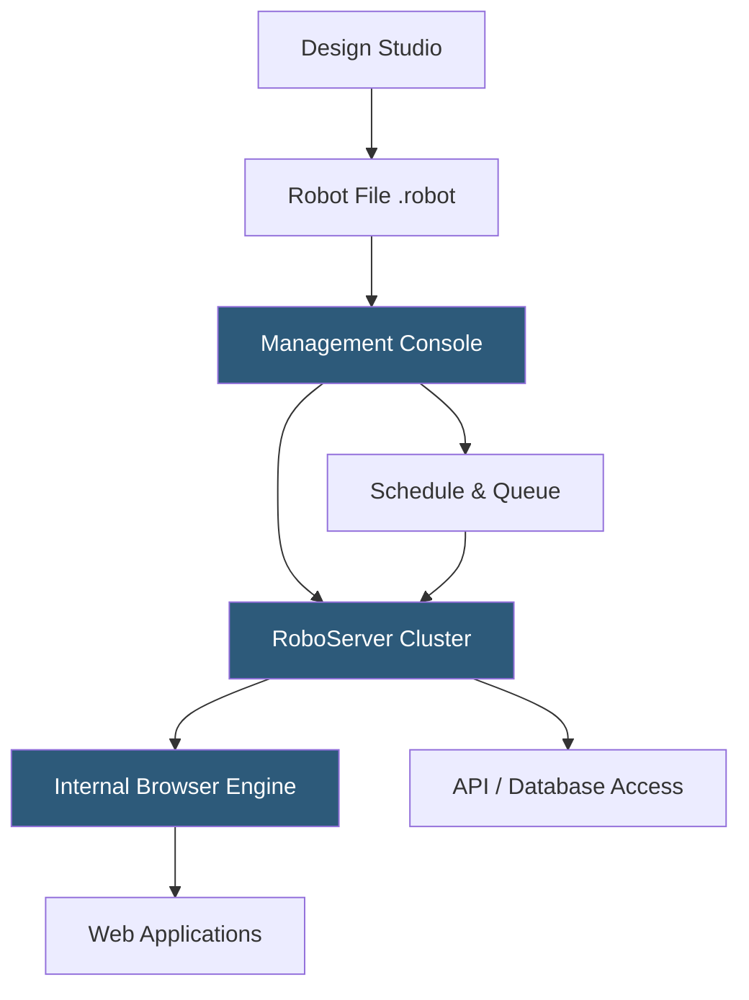

**Category:** RPA (Robotic Process Automation)
**Difficulty:** Intermediate
**Reading time:** 6 min read

---

Kofax RPA (formerly Kapow) is an enterprise RPA platform by Kofax (now Tungsten Automation) distinguished by its headless browser-based automation model using a proprietary robot engine. It excels at web data extraction and integration scenarios, with a visual robot design studio and a Management Console for orchestrating robot deployments across on-premises infrastructure.

- **Robot** — a Kofax automation unit that navigates web and application interfaces using an internal browser engine
- **Design Studio** — the Windows-based IDE for building Kofax robots with a visual interface and step wizard
- **Management Console** — the server component orchestrating robot deployments, schedules, and monitoring
- **Robot File** — the compiled robot artifact (.robot) deployed to the Management Console
- **Kapplet** — a web-hosted user interface wrapping a robot, enabling business users to trigger attended robots via a browser form
- **Roboserver** — the execution engine running Kofax robots, typically deployed on-premises
- **Intelligent Automation** — Kofax's broader platform combining RPA with document intelligence (ReadSoft, MarkView) and process orchestration

Kofax Design Studio provides a robot development environment where developers build automation by stepping through web pages and application screens. The studio renders a live preview of the target application using Kofax's internal browser engine, allowing developers to click elements to generate action steps—navigating pages, extracting data into variables, submitting forms, and branching on page content.

Kofax's proprietary browser engine runs independently of the user's installed browsers. This design provides consistency across deployments and enables high-speed headless execution without browser profile management. For applications requiring a real browser (JavaScript-heavy SPAs, browser-specific behavior), Kofax supports driving Chrome in attended or unattended modes.

The Action Map approach defines all automation logic as a tree of conditions and actions. Each branch of the tree represents a page state the robot might encounter, with conditions checking page content and actions responding appropriately. This implicit exception handling makes robots more resilient to page variations than linear sequential automation.

RoboServers execute robots and connect to the Management Console for job scheduling, queue processing, and centralized logging. The console supports horizontal scaling by adding RoboServers to a cluster. Robots can call REST APIs, query databases via JDBC, and read/write files, enabling integration beyond pure UI automation.

Kapplets provide a self-service interface for business users—a web form where users enter parameters and trigger a robot run without accessing the Management Console.

- Web data extraction and aggregation from multiple sources
- Legacy web application integration lacking API access
- Web-to-database data synchronization workflows
- Financial data collection from bank portals and broker systems
- Government and insurance form processing via web portals

| Advantage | Disadvantage |
|-----------|--------------|
| Proprietary browser engine provides consistent execution | Higher cost than cloud-native platforms; on-premises focus |
| Action Map approach handles page variations resiliently | Design Studio interface less modern than UiPath or AA |
| Deep web data extraction capabilities | Smaller developer community than market leaders |
| Integration with Kofax document intelligence platform | Migration to Kofax from competitors complex and disruptive |

- [Robot Framework Automation](robot-framework-automation.md)
- [WorkFusion Intelligent Automation](workfusion-intelligent-automation.md)
- [UiPath Automation Platform](uipath-automation-platform.md)

---
*Part of the [RPA (Robotic Process Automation)](index.md) category · [Back to Master Index](../../index.md)*
