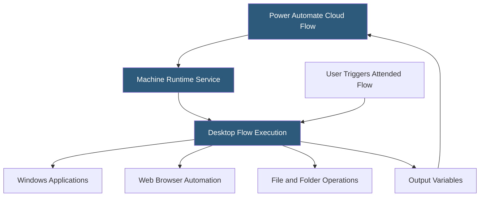

**Category:** RPA (Robotic Process Automation)
**Difficulty:** Beginner
**Reading time:** 5 min read

---

Microsoft Power Automate Desktop is a Windows-native RPA tool included free with Windows 10 and 11 that enables users to automate repetitive desktop tasks through a visual flow designer with hundreds of built-in actions. It bridges Power Platform cloud flows and desktop applications, enabling both attended automation by individual users and unattended automation via cloud-hosted machines.

- **Desktop Flow** — a Power Automate Desktop automation composed of actions targeting Windows applications, web browsers, and system operations
- **Action** — a pre-built automation step in the PAD library (click, type, read file, launch application, call API)
- **Recorder** — a tool that captures user interactions and converts them into a sequence of actions in a flow
- **Subflow** — a reusable named group of actions within a larger flow, equivalent to a subroutine
- **Power Platform Integration** — the ability to trigger desktop flows from cloud flows (Power Automate), enabling hybrid cloud-desktop automation
- **Sensitive Variable** — a PAD variable type that masks its value in logs and the designer, used for credentials
- **Machine Runtime** — a Windows service that connects the local machine to Power Automate cloud for unattended execution

Power Automate Desktop installs as a Windows application and registers the local machine with the Power Platform cloud through the Machine Runtime service. Flows are built in the visual designer using a two-pane interface: available actions on the left, the flow workspace on the right. Developers drag actions into the workspace or use the recorder to capture interactions.

The recorder monitors keyboard and mouse events and translates them into typed actions. A web recorder captures interactions in Chrome, Edge, or Firefox using browser extension hooks, generating web element actions with CSS selectors. A desktop recorder captures Windows application interactions using UI automation accessibility APIs, generating corresponding click and type actions.

Variables pass data between actions. Inputs from triggering cloud flows populate input variables; output variables return data to the cloud flow. The flow can branch with IF conditions, loop with For Each and While constructs, and call subflows for reusable logic segments.

For unattended execution, Power Automate Cloud triggers desktop flows on registered machines via the Machine Runtime connection. The cloud flow specifies which machine or machine group to target, and Machine Runtime on the Windows machine receives the trigger, launches the desktop flow, and returns output variables when complete. Microsoft 365 business licenses include attended RPA; unattended execution requires a Power Automate per-flow or per-user premium plan.

- Individual users automating repetitive copy-paste tasks between applications
- Finance teams automating Excel data collection from multiple sources
- IT teams automating Windows administration tasks
- HR users automating data entry across HR portals and internal systems
- Business users creating personal productivity automations without IT involvement

| Advantage | Disadvantage |
|-----------|--------------|
| Free with Windows 10/11 lowers barrier to entry | Unattended execution requires paid premium license |
| Deep Microsoft 365 integration via Power Platform | Less robust than enterprise RPA for complex processes |
| No-code recorder enables non-developers to automate | Flow management and governance features limited vs. UiPath/AA |
| Native Windows integration outperforms browser-based tools | Limited cross-platform support (Windows only for desktop flows) |

- [Power Automate Cloud Flows](power-automate-cloud-flows.md)
- [Power Automate AI Builder](power-automate-ai-builder.md)
- [RPA Attended vs Unattended Bots](rpa-attended-vs-unattended-bots.md)

---
*Part of the [RPA (Robotic Process Automation)](index.md) category · [Back to Master Index](../../index.md)*
