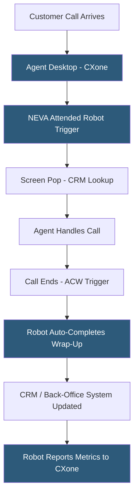

**Category:** RPA (Robotic Process Automation)
**Difficulty:** Intermediate
**Reading time:** 6 min read

---

NICE CXone RPA (formerly NICE Robotic Automation) is a contact center-focused RPA solution integrated within the NICE CXone cloud customer experience platform. It specializes in attended automation for contact center agents, automating repetitive after-call work and during-call data retrieval across the desktop applications agents use, while providing unattended automation for back-office processes.

- **Desktop Automation** — attended automation running on agent workstations during customer interactions
- **After-Call Work (ACW) Automation** — robots automatically completing post-call data entry, reducing average handle time
- **Agent Desktop Integration** — embedding robot triggers within the agent desktop softphone or CRM interface
- **NICE Employee Virtual Attendant (NEVA)** — NICE's branded attended robot that assists agents in real time
- **Workforce Optimization Integration** — connecting RPA data (time saved, exceptions) with WFM forecasting systems
- **API Automation** — backend process automation using REST APIs alongside UI automation
- **Central Management** — a cloud-hosted management console for deploying and monitoring contact center robots

NICE CXone RPA integrates robot execution directly into the contact center agent workflow. When a customer call connects, the NEVA robot triggers automatically based on CXone events—recognizing the interaction type, customer ID, or queue—and performs screen pop actions: opening the CRM, searching for the customer by phone number, and pre-populating the case creation form. The agent receives the customer information instantly without manual lookup.

During calls, NEVA can assist with guided procedures—presenting step-by-step instructions based on the call type—or automating lookup tasks the agent would otherwise perform manually (checking order status, pulling account details from legacy systems, verifying insurance eligibility). These interactions run on the agent's desktop, with the robot overlaying a thin UI on top of existing applications.

After-call work automation is a primary CXone RPA use case. After a call ends, NEVA captures data entered during the call (disposition codes, case notes) and automatically fills in required fields across multiple systems—updating the CRM, sending a confirmation email, creating a follow-up task in the ticketing system—while the agent is already available for the next call. This reduces ACW from minutes to seconds.

Unattended robots run on server infrastructure for overnight batch processing: generating reports, reconciling records, processing queued work items accumulated during business hours.

- Contact center ACW automation reducing agent post-call workload
- Real-time CRM screen pop for inbound customer calls
- Cross-system customer data verification during interactions
- Compliance checklist automation ensuring required fields complete
- Overnight batch processing of contact center data

| Advantage | Disadvantage |
|-----------|--------------|
| Deep CXone integration provides native contact center context | Limited to organizations using NICE CXone platform |
| Real-time agent assistance measurably reduces handle time | Less capable than standalone RPA for complex back-office processes |
| Agent desktop embedding requires minimal training | Attended robot coverage requires licensed installations on every agent desktop |
| Built-in workforce optimization metrics integration | Premium cost adds to already significant CXone licensing investment |

- [SAP Intelligent RPA](sap-intelligent-rpa.md)
- [RPA Attended vs Unattended Bots](rpa-attended-vs-unattended-bots.md)
- [Automation Anywhere Platform](automation-anywhere-platform.md)

---
*Part of the [RPA (Robotic Process Automation)](index.md) category · [Back to Master Index](../../index.md)*
