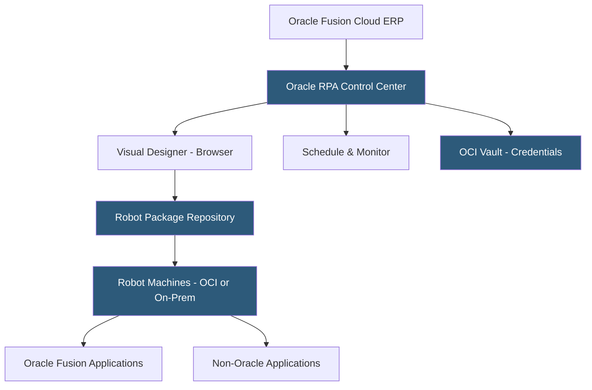

**Category:** RPA (Robotic Process Automation)
**Difficulty:** Intermediate
**Reading time:** 6 min read

---

Oracle Robotic Process Automation is Oracle's cloud-native RPA service on Oracle Cloud Infrastructure (OCI), providing a visual low-code designer, attended and unattended robot execution, and native integration with Oracle Fusion Cloud Applications. It enables automation of both Oracle and non-Oracle applications, positioning Oracle RPA as the natural automation layer for organizations running Oracle ERP, HCM, and CX suites.

- **Oracle RPA Studio** — the browser-based visual automation designer for creating robot workflows without thick-client IDE installation
- **Attended Process** — a robot triggered by a user action within an Oracle Fusion application or via desktop trigger
- **Unattended Process** — a scheduled or event-driven robot running without user interaction on cloud or on-premises machines
- **Oracle Integration** — native connectors to Oracle Fusion ERP, HCM, SCM, and CX modules
- **Robot Machine** — a Windows machine with the Oracle RPA Agent installed for execution
- **SaaS Automation** — pre-built robot templates targeting common Oracle Fusion Cloud process scenarios
- **OCI Vault Integration** — secure credential storage within Oracle Cloud Infrastructure for robot credential management

Oracle RPA operates as a managed service on OCI, with the Control Center providing project management, robot deployment, and monitoring. The browser-based designer presents a flowchart-style canvas where developers drag action components—including dedicated Oracle Fusion activity blocks for interacting with Oracle Cloud applications via their UIs or REST APIs.

For Oracle Fusion automation, Oracle RPA provides application-aware components that understand Oracle VBCS (Visual Builder Cloud Service) and Oracle JET component structures. This enables more reliable UI automation of Oracle Fusion applications compared to generic screen scraping, similar to how SAP iRPA understands SAP GUI structures.

Oracle Cloud REST API integration is a first-class capability. Many Oracle Fusion automation scenarios are implemented by calling Oracle REST APIs rather than driving the UI—creating journal entries via the REST API is more reliable than navigating the Oracle Financials UI. Oracle RPA wraps these API calls in pre-built activity components.

The agent-based execution model installs the Oracle RPA Agent on Windows machines. For cloud execution, Oracle offers OCI-hosted robot machines that reduce infrastructure management burden. Machines connect to the Control Center via HTTPS, poll for assigned jobs, execute workflows, and report results.

Pre-built automation packages target Oracle Fusion process pain points: period-end close procedures, supplier invoice matching in Oracle Payables, onboarding workflows in Oracle HCM, and order management processes in Oracle SCM.

- Oracle Fusion period-end close automation
- Oracle Cloud ERP exception processing and reconciliation
- Cross-system automation bridging Oracle Fusion and third-party applications
- Mass data loading and validation in Oracle HCM
- Oracle-to-Oracle data synchronization across business units

| Advantage | Disadvantage |
|-----------|--------------|
| Native Oracle Fusion integration improves reliability | Limited value outside Oracle application ecosystem |
| OCI-managed infrastructure reduces robot machine overhead | Smaller community and marketplace than top-tier RPA vendors |
| Bundling with Oracle Cloud can reduce total licensing cost | Less mature than established platforms like UiPath |
| Browser-based designer eliminates local IDE installation | Advanced capabilities lag behind market leaders in features |

- [SAP Intelligent RPA](sap-intelligent-rpa.md)
- [UiPath Orchestrator](uipath-orchestrator.md)
- [RPA Center of Excellence (CoE)](rpa-center-of-excellence-coe.md)

---
*Part of the [RPA (Robotic Process Automation)](index.md) category · [Back to Master Index](../../index.md)*
