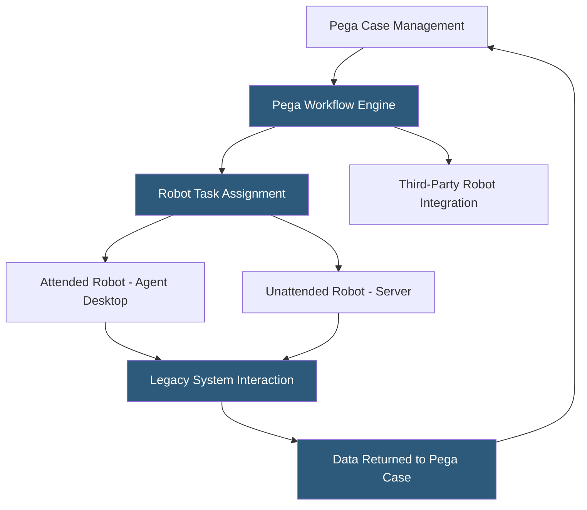

**Category:** RPA (Robotic Process Automation)
**Difficulty:** Advanced
**Reading time:** 6 min read

---

Pega Platform integrates RPA capabilities directly into its low-code BPM and CRM suite, enabling automation of legacy system interactions within broader Pega case management workflows. Pega Robotic Automation supports both attended automation (helping agents during customer interactions) and unattended batch processing, with robots managed within the Pega ecosystem rather than a standalone RPA orchestrator.

- **Pega Robotic Automation** — the RPA component of Pega Platform providing robot design and execution capabilities
- **Attended Robot** — a robot running on an agent's desktop, triggered by events in the Pega UI to automate steps in legacy systems
- **Unattended Robot** — a headless robot running on server infrastructure, processing work items from Pega queues
- **Robot Runtime** — the Pega runtime engine installed on agent desktops or servers executing robot definitions
- **Case Management Integration** — Pega's native data flow between case records and robot executions, passing case data to robots
- **Open RPA** — Pega's strategy of supporting integration with third-party robots (UiPath, AA) from within Pega workflows
- **RPA Fabric** — Pega's microservices-based architecture enabling cloud-native robot deployment and management

Pega Platform's RPA capability differs from standalone RPA tools because it exists within a complete BPM and case management environment. Organizations using Pega for case management or customer service can augment their Pega workflows with robot steps that automate interactions with legacy systems—mainframes, third-party portals, desktop applications—without replacing their Pega investment.

Attended robots run alongside Pega UI on agent desktops. When an agent's Pega workflow reaches a step requiring interaction with a legacy system (pulling up an account in an old claims system, entering data into a government portal), Pega triggers the robot, which performs the required actions automatically while the agent waits. Results populate back into the Pega case record automatically.

Robot definitions are built using Pega's Robotic Automation Studio—a Windows-based IDE that captures application interactions and generates automation logic. The studio supports web, Windows, and Java application automation. Robots reference data passed from Pega cases through a standardized interface, maintaining the separation between business logic (in Pega) and automation execution (in the robot).

The Open RPA capability extends this model to third-party robots. Organizations with existing UiPath or Automation Anywhere investments can invoke those robots from Pega workflows, providing a unified orchestration layer within Pega without mandating migration to Pega's native RPA.

- Insurance claims processing bridging Pega case management and legacy claims systems
- Bank customer onboarding automating data entry across multiple back-end systems
- Telecom service provisioning integrating Pega CRM with legacy provisioning systems
- Government benefit processing automating across multiple state and federal systems
- Healthcare prior authorization workflows spanning EHR and payer portals

| Advantage | Disadvantage |
|-----------|--------------|
| Native Pega integration eliminates case-to-robot handoff complexity | Only valuable for organizations already using Pega Platform |
| Single platform for BPM and RPA reduces vendor count | Pega licensing and implementation cost is very high |
| Open RPA enables coexistence with existing RPA investments | Pega Robotic Automation less feature-rich than standalone RPA platforms |
| Case data flows seamlessly to robots without custom integration | Lock-in to Pega ecosystem for combined BPM/RPA scenarios |

- [WorkFusion Intelligent Automation](workfusion-intelligent-automation.md)
- [SAP Intelligent RPA](sap-intelligent-rpa.md)
- [RPA Governance Frameworks](rpa-governance-frameworks.md)

---
*Part of the [RPA (Robotic Process Automation)](index.md) category · [Back to Master Index](../../index.md)*
