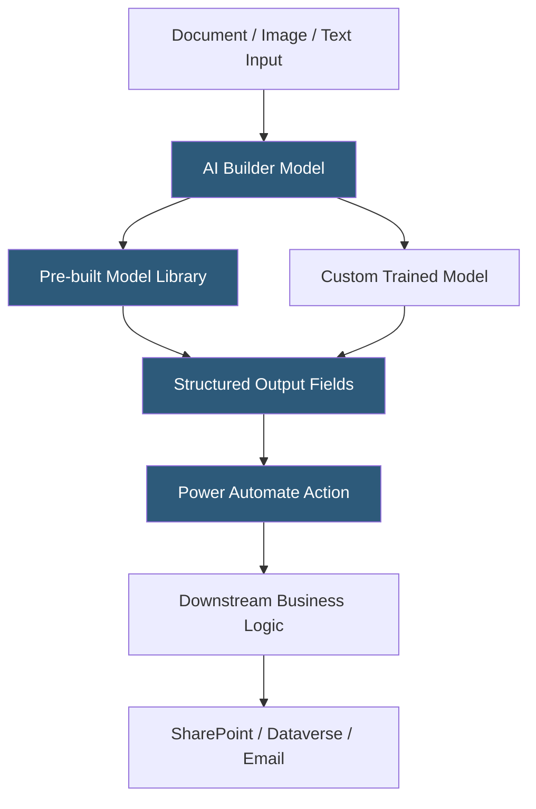

**Category:** RPA (Robotic Process Automation)
**Difficulty:** Intermediate
**Reading time:** 6 min read

---

Power Automate AI Builder is Microsoft's low-code AI service embedded within the Power Platform that enables business users to add AI capabilities—document processing, object detection, text classification, and prediction—to their Power Automate flows without writing code or training deep learning models from scratch. It leverages pre-built AI models and a simplified custom model training interface.

- **Pre-built Model** — a ready-to-use AI model (business card reader, receipt processor, ID reader) deployable without custom training
- **Custom Model** — a model trained on organization-specific data using a guided labeling interface in AI Builder
- **Document Processing Model** — an AI model extracting named fields from document images using form recognition
- **Prediction Model** — a binary or multi-class classification model trained on tabular Dataverse data to predict outcomes
- **AI Credit** — the Microsoft billing unit for AI Builder consumption; charged per AI Builder action execution in flows
- **Power Fx AI Functions** — formula functions in Power Apps and Power Automate enabling direct AI model invocation
- **Environment** — a Power Platform workspace where AI Builder models are stored and executed

AI Builder models integrate with Power Automate through dedicated action steps in the flow designer. A flow that processes incoming invoices can include an "AI Builder - Extract information from invoices" action that accepts a file input and returns extracted fields (vendor name, invoice number, line items, totals) as structured output variables for subsequent actions.

Pre-built models cover common business scenarios. The invoice processing model handles standard invoice layouts with high accuracy out of the box. The business card reader extracts contact details from photographed cards. The receipt processor handles retail receipts. These pre-built models consume AI credits per execution but require no training or configuration beyond adding the action to a flow.

Custom model training uses a labeling studio within AI Builder. For document processing, users upload sample documents and draw boxes around the fields they want to extract, assigning field names to each labeled region. After labeling 5–50 sample documents, the training pipeline fine-tunes an Azure Form Recognizer model on the organization's specific document layouts. Published models appear as selectable model options in the flow action.

Prediction models train on tabular Dataverse data to classify records or predict outcomes—predicting which loan applications will default, classifying customer support tickets by category, or predicting employee attrition risk. The training wizard guides users through data selection, feature configuration, and model evaluation before publishing.

- Automated invoice processing without manual data entry
- Customer feedback text classification for routing to departments
- Product image analysis for catalog quality control
- Supplier document processing in procurement workflows
- Lead scoring prediction for CRM records

| Advantage | Disadvantage |
|-----------|--------------|
| No ML expertise required; guided labeling UI | AI credit consumption cost can be significant at volume |
| Pre-built models cover common document types immediately | Custom model accuracy requires sufficient labeled training samples |
| Deep Power Platform integration enables rapid deployment | Limited model types vs. Azure ML for data scientists |
| Prediction models make ML accessible to business analysts | Models locked to Power Platform; not portable to other systems |

- [Power Automate Cloud Flows](power-automate-cloud-flows.md)
- [Microsoft Power Automate Desktop](microsoft-power-automate-desktop.md)
- [UiPath AI Fabric](uipath-ai-fabric.md)

---
*Part of the [RPA (Robotic Process Automation)](index.md) category · [Back to Master Index](../../index.md)*
