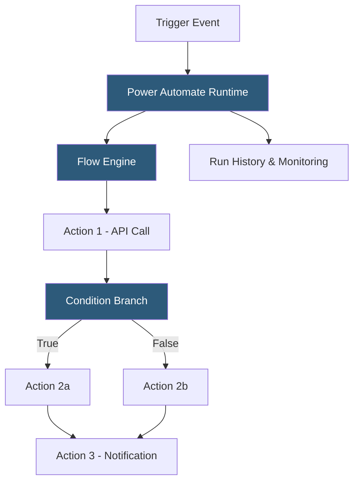

**Category:** RPA (Robotic Process Automation)
**Difficulty:** Beginner
**Reading time:** 5 min read

---

Power Automate cloud flows are cloud-hosted automation workflows that integrate Microsoft 365 services, third-party APIs, and desktop automations without requiring local software installation. They operate as an iPaaS (integration platform as a service) with a low-code visual designer, enabling business users to automate cross-application workflows involving email, SharePoint, Teams, Dataverse, and hundreds of third-party connectors.

- **Trigger** — the event that initiates a cloud flow (new email arrives, file added to SharePoint, button clicked, schedule fires)
- **Action** — a step in the flow performing a specific operation (send email, create record, call HTTP endpoint, update row)
- **Connector** — a pre-built API wrapper providing access to a specific service (Salesforce, Jira, Twitter, SAP)
- **Automated Flow** — a flow triggered automatically by a system event without human intervention
- **Instant Flow** — a flow triggered manually by a user clicking a button in Teams, mobile app, or browser
- **Scheduled Flow** — a flow triggered on a configurable time interval (hourly, daily, weekly)
- **Business Process Flow** — a guided workflow modeling multi-step human processes in Dataverse applications

Power Automate cloud flows run on Microsoft Azure infrastructure, executing flow logic in a serverless, event-driven manner. Each flow begins with a trigger configuration—either polling (checking an API endpoint every few minutes for new data) or push (receiving a webhook notification from a service when an event occurs). Push triggers provide near-real-time execution while polling triggers have configurable intervals from one minute to longer periods.

The visual designer presents a linear or branching sequence of action steps. Each action connects to an external service through a connector. Connectors manage OAuth authentication tokens for each user's connected accounts, refreshing tokens automatically. Standard connectors (Exchange, SharePoint, Teams, OneDrive) are included with Microsoft 365 licenses; premium connectors (Salesforce, ServiceNow, SAP) require a Power Automate premium license.

Expressions using Power Fx (a formula language similar to Excel) enable data transformation within flows—extracting substrings, formatting dates, parsing JSON, and evaluating conditions. Apply to Each loops iterate over arrays of items (emails in a folder, rows in a table, files in a folder). Parallel branch actions run multiple paths simultaneously and converge.

Error handling uses Try-Catch-Finally patterns through the Scope action. Run history displays every flow execution with per-action input and output data, enabling debugging without additional tooling.

- Automating approval workflows for expense reports or document sign-offs
- Synchronizing data between CRM systems and spreadsheets or SharePoint
- Sending notifications to Teams channels when business events occur
- Processing email attachments and filing them in SharePoint
- Triggering desktop flows on registered machines for application automation

| Advantage | Disadvantage |
|-----------|--------------|
| No infrastructure management; fully serverless | Connector throttling limits high-volume transaction processing |
| 1,000+ connectors cover most enterprise applications | Premium connectors require additional licensing |
| Deep Microsoft 365 integration for most enterprise scenarios | Complex logic (loops, error handling) requires Power Fx knowledge |
| Run history provides built-in debugging and audit trail | Polling connectors introduce latency vs. push triggers |

- [Microsoft Power Automate Desktop](microsoft-power-automate-desktop.md)
- [Power Automate AI Builder](power-automate-ai-builder.md)
- [Power Automate Process Advisor](power-automate-process-advisor.md)

---
*Part of the [RPA (Robotic Process Automation)](index.md) category · [Back to Master Index](../../index.md)*
