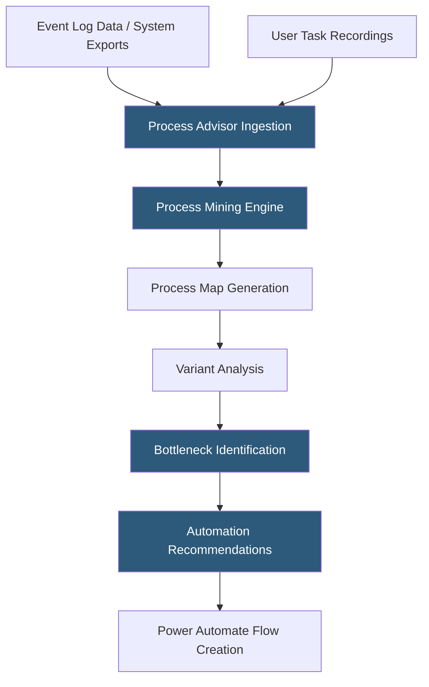

**Category:** RPA (Robotic Process Automation)
**Difficulty:** Intermediate
**Reading time:** 6 min read

---

Power Automate Process Advisor is a process mining and task mining tool within the Microsoft Power Platform that analyzes business process event logs and recorded user activities to identify inefficiencies, bottlenecks, and automation opportunities. It provides visual process maps, performance analytics, and direct integration with Power Automate to accelerate automation discovery.

- **Process Mining** — the analysis of event log data from IT systems to reconstruct and visualize how processes actually execute
- **Task Mining** — the recording of user interactions (screen, keyboard, mouse) to understand manual task execution patterns
- **Process Map** — a visual flow diagram generated from event log analysis showing all paths through a process with frequency and timing
- **Variant** — a unique path through a process from start to end; processes with many variants indicate inconsistency
- **Bottleneck Analysis** — identification of process steps with high wait times or rework rates
- **Activity** — a named step in a process, identified from event log records (e.g., "Create Order", "Approve Invoice")
- **Recording Group** — a set of task mining recordings from multiple users performing the same process for aggregate analysis

Process Advisor operates through two distinct analysis modes. Process mining mode ingests event log data exported from source systems—ERP, CRM, or BPM systems that record activity timestamps and case identifiers. Users map their exported CSV or Excel data to the required schema (case ID, activity name, start timestamp, end timestamp) and Process Advisor reconstructs the process flow by grouping events by case and ordering by timestamp.

The resulting process map shows every execution path taken across all analyzed cases, with path frequency, median duration, and variance statistics for each step transition. Variant analysis groups cases by their unique execution path—a purchase order process might have 12 variants, indicating inconsistent handling. Filtering by variant reveals which paths take longest, have the most rework loops, or have the highest error rates.

Task mining mode requires participants to install a small desktop recording agent that captures screen content, mouse clicks, and keyboard events while performing a process. Recordings upload to Process Advisor, which uses computer vision to identify application contexts and aggregate similar interactions across multiple recordings. The resulting task map shows the common sequence of steps, application switching patterns, and timing data.

Automation recommendations highlight high-frequency, time-consuming manual steps as automation candidates and include a direct "Automate" button that opens a Power Automate flow pre-configured with the identified trigger and first actions. This integration shortens the path from discovery to deployed automation.

- Discovering automation opportunities in accounts payable or HR processes
- Standardizing inconsistent process variants to reduce training burden
- Identifying bottlenecks in customer onboarding workflows
- Building automation business cases with data-backed effort estimates
- Ongoing process monitoring after automation deployment to verify improvement

| Advantage | Disadvantage |
|-----------|--------------|
| Embedded in Power Platform with no additional infrastructure | Requires event log data quality; poor logs produce misleading maps |
| Direct integration with Power Automate for discovery-to-build | Task mining recording requires participant cooperation and privacy consent |
| Accessible to business analysts without process mining expertise | Limited compared to dedicated process mining tools like Celonis or Minit |
| Task mining provides ground-truth data on manual process steps | Data preparation for process mining is time-consuming |

- [Power Automate Cloud Flows](power-automate-cloud-flows.md)
- [Microsoft Power Automate Desktop](microsoft-power-automate-desktop.md)
- [RPA Center of Excellence (CoE)](rpa-center-of-excellence-coe.md)

---
*Part of the [RPA (Robotic Process Automation)](index.md) category · [Back to Master Index](../../index.md)*
