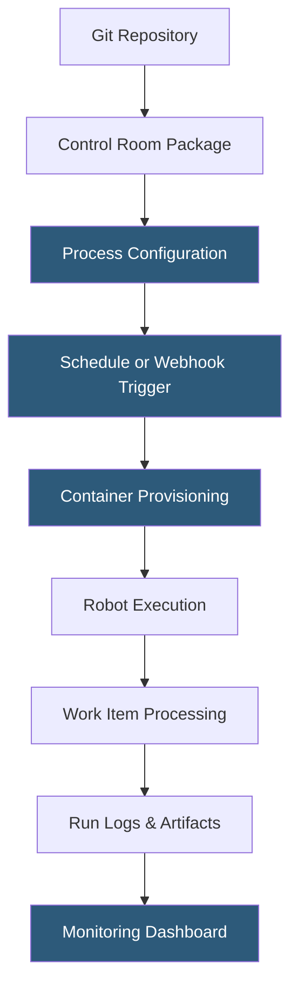

**Category:** RPA (Robotic Process Automation)
**Difficulty:** Intermediate
**Reading time:** 5 min read

---

Robocorp Control Room is the cloud-hosted orchestration and monitoring platform for Robocorp robots, providing deployment management, process scheduling, work item queuing, secret storage, and run analytics. It integrates with Git repositories for source-based deployment and exposes a REST API for triggering runs from external systems.

- **Workspace** — an isolated organizational unit in Control Room containing processes, robots, and team members
- **Process** — a configured deployment linking a robot codebase (from a Git-connected package) to execution parameters
- **Run** — a single execution instance of a process, tracked with logs, work items, and status
- **Work Item Queue** — a managed queue of input items consumed by robot runs, supporting retry logic and error tracking
- **Vault** — an encrypted secrets store where API keys, passwords, and tokens are stored and injected into runs at execution time
- **Asset** — a named value (text, file, credential) stored in Control Room and accessible to robots during execution
- **Webhook Trigger** — an HTTP endpoint that initiates a process run when called by an external system

Control Room connects to Git repositories (GitHub, GitLab, Bitbucket) through OAuth integrations. A package in Control Room points to a repository and branch. When the branch updates, Control Room detects the change and makes the new version available for process configuration. Processes link a package version to execution settings: environment variables, input work item queue, output configuration, and machine type for execution.

Scheduling supports both cron-style time triggers and event-based webhook triggers. The webhook trigger provides a unique HTTPS endpoint per process; calling it with a POST request containing JSON input launches a run immediately. This pattern integrates Control Room into Zapier, n8n, CI/CD pipelines, or custom application workflows.

Work item queues hold input records as JSON objects. External systems can add items to a queue via API; consumer processes poll the queue and process one item per run (or batch items per run for efficiency). Failed items enter an error state with the failure message attached, enabling developers to inspect and requeue failed items.

The Vault encrypts secrets using AES-256 at rest. Robot code accesses vault items by name using the RPA Framework's vault library—`robocorp.vault.get_secret("salesforce-credentials")`. Secrets are never logged or exposed in run output. Control Room's REST API exposes all operations, enabling GitOps workflows where infrastructure-as-code pipelines configure processes programmatically.

- Deploying Git-managed robots without infrastructure management
- Triggering automation runs from external business systems via webhook
- Managing work item queues for high-volume document processing
- Secure credential management for robot API authentication
- Monitoring robot performance and error rates across an automation program

| Advantage | Disadvantage |
|-----------|--------------|
| Git-native deployment enables true DevOps for RPA | Smaller ecosystem than UiPath Orchestrator or AA Control Room |
| Container execution eliminates robot machine management | Limited visual workflow monitoring vs. established platforms |
| REST API first-class makes integration straightforward | Requires developer expertise to leverage full platform capabilities |
| Transparent pricing per run vs. per-robot licensing | No on-premises deployment option for data sovereignty requirements |

- [Robocorp Python-Based RPA](robocorp-python-based-rpa.md)
- [Robocorp Process Studio](robocorp-process-studio.md)
- [UiPath Orchestrator](uipath-orchestrator.md)

---
*Part of the [RPA (Robotic Process Automation)](index.md) category · [Back to Master Index](../../index.md)*
