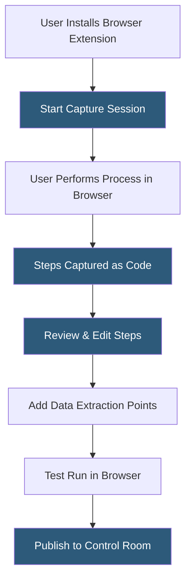

**Category:** RPA (Robotic Process Automation)
**Difficulty:** Beginner
**Reading time:** 5 min read

---

Robocorp Process Studio is a visual, browser-based automation builder that extends Robocorp's developer-centric platform to less technical users. It provides a no-code/low-code interface for creating automation workflows using AI-driven process capture, where users demonstrate a process by performing it in a browser and the tool generates the automation code automatically.

- **Process Capture** — recording user interactions in a browser to generate automation code automatically
- **Step** — a captured interaction (click, type, extract) that becomes a unit in the generated automation flow
- **AI Extraction** — intelligent identification of data to extract from web pages based on user demonstrations
- **Generated Code** — Python code using the RPA Framework produced by Process Studio from captured interactions
- **Browser Extension** — a Chrome/Edge extension that enables Process Studio's capture functionality
- **Edit Mode** — the interface for reviewing, modifying, and adding steps to a captured automation flow
- **Publish to Control Room** — the action of deploying a completed Process Studio automation to Robocorp Control Room

Process Studio operates as a web application within the Robocorp platform. Users install a browser extension that enables the capture mechanism. When a capture session starts, the extension records all interactions—page navigations, clicks, form inputs, and data reading—and streams events to Process Studio.

After capture, Process Studio reconstructs the recorded session as a visual step list, with each step showing a screenshot of the page state and the captured action. The user reviews each step, adjusting element selectors if needed (Process Studio uses CSS selectors and XPath) and marking data extraction points—places where the automation should read a value from the page into a variable.

The AI extraction feature detects patterns in repeated interactions. When a user demonstrates extracting a row of data from a table, Process Studio infers that the automation should extract all rows of that table, generating a loop that iterates through all elements matching the detected pattern.

The visual step editor allows non-developers to modify logic by adding conditions, adjusting selectors, or reordering steps without touching Python code. Once satisfied with the flow, users run a test within the browser to validate behavior. Publishing pushes the automation to Robocorp Control Room as a standard robot project with the generated Python code, where it can be scheduled and monitored like any other Robocorp robot.

- Business users automating web-based data collection tasks
- Rapid prototyping of browser automation workflows before developer refinement
- Non-technical teams creating department-level automations
- Demonstrating automation capabilities to stakeholders quickly
- Training examples for RPA onboarding programs

| Advantage | Disadvantage |
|-----------|--------------|
| No-code capture makes automation accessible to non-developers | Limited to web browser automation; no desktop app support |
| AI extraction reduces manual step configuration | Generated code quality varies; often needs developer cleanup |
| Produces actual Python code enabling developer enhancement | Fragile to website UI changes without selector maintenance |
| Direct Control Room integration for production deployment | Limited logic complexity compared to full Studio development |

- [Robocorp Python-Based RPA](robocorp-python-based-rpa.md)
- [Robocorp Control Room](robocorp-control-room.md)
- [UiPath Studio Workflow Designer](uipath-studio-workflow-designer.md)

---
*Part of the [RPA (Robotic Process Automation)](index.md) category · [Back to Master Index](../../index.md)*
