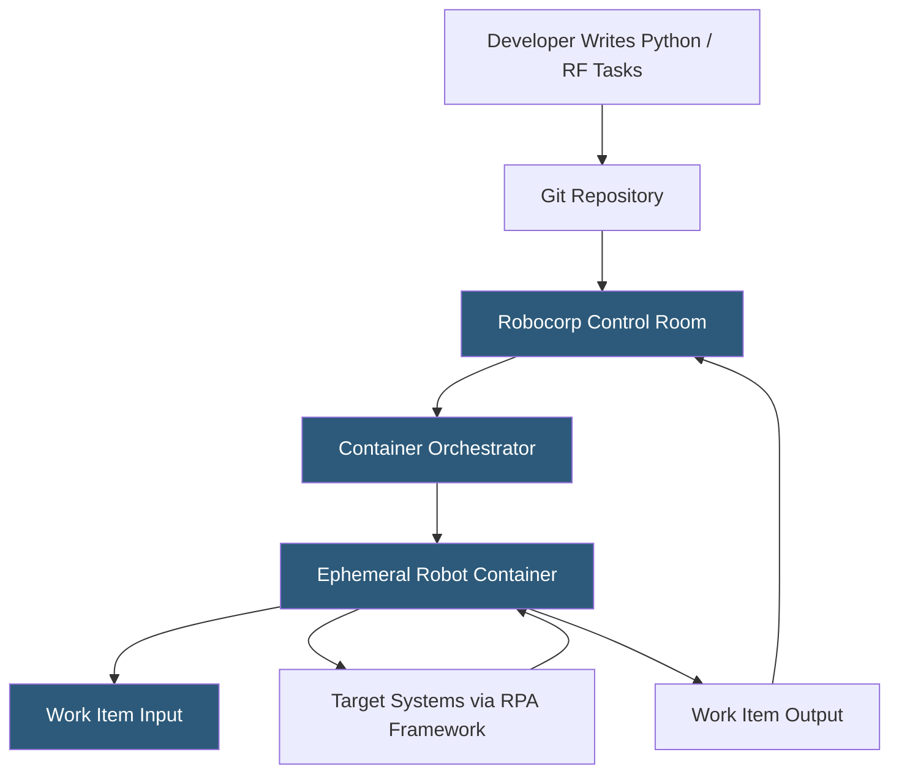

**Category:** RPA (Robotic Process Automation)
**Difficulty:** Intermediate
**Reading time:** 6 min read

---

Robocorp is an open-source RPA platform built on Python and Robot Framework, offering a developer-centric approach to automation that treats robots as code managed through standard software engineering practices—version control, CI/CD pipelines, and package management. It runs automation in cloud-based containers, eliminating the need for dedicated robot machines.

- **RPA Framework** — Robocorp's open-source Python library providing browser automation, desktop interaction, and process control keywords
- **Robot** — a Robocorp automation project containing a robot.yaml configuration file and Python/Robot Framework task files
- **Work Item** — a JSON-serializable input/output data unit passed to robots for processing, equivalent to queue items in other platforms
- **Robocorp Control Room** — the hosted platform for deploying, scheduling, and monitoring robot runs
- **Conda Environment** — Robocorp uses conda-based isolated environments ensuring dependency consistency across development and production
- **VS Code Extension** — the Robocorp extension for Visual Studio Code providing robot development, debugging, and Control Room integration
- **Container Execution** — robots run in ephemeral cloud containers, eliminating robot machine management overhead

Robocorp robots are Python projects structured with a robot.yaml file (declaring entry points and environment configuration) and task files written either in Python or Robot Framework syntax. The RPA Framework library provides task-specific keywords: `Open Browser`, `Click Element`, `Get Text`, `Send Keys` for browser automation, and system-level actions for file operations, email, and Excel manipulation.

The conda environment specification (conda.yaml) pins Python version and all dependency versions, ensuring the robot behaves identically in development and production. Robocorp's tooling resolves the environment automatically, eliminating "it works on my machine" issues.

Deployment to Robocorp Control Room links a Git repository. Control Room monitors the repository for changes and deploys new versions automatically—a true DevOps pattern for RPA. When a run triggers, Control Room provisions an ephemeral container with the correct environment, mounts the robot code, and executes it. Containers spin down after execution, so there are no idle robot machines consuming resources.

Work items replace queue concepts from traditional RPA. A robot receives one or more work items as JSON input, processes them, and produces output work items or reports failure. This pattern integrates naturally with REST APIs, CI/CD pipelines, and webhook triggers.

- Developer-led automation programs preferring code-first approaches
- Organizations applying software engineering practices to RPA (GitOps, CI/CD)
- Automations requiring custom Python libraries not available in visual RPA tools
- Cloud-native automation eliminating on-premises robot machine management
- Teams combining traditional RPA with data science Python workflows

| Advantage | Disadvantage |
|-----------|--------------|
| Code-first approach enables full software engineering practices | Requires Python development skills; not accessible to non-developers |
| Container execution eliminates robot machine management | Limited visual/no-code tooling for business user automation |
| Open-source RPA Framework reduces vendor lock-in | Smaller ecosystem and community than UiPath or Automation Anywhere |
| Git-based deployment enables CI/CD and code review for RPA | Desktop GUI automation in containers requires virtual display configuration |

- [Robocorp Control Room](robocorp-control-room.md)
- [Robot Framework Automation](robot-framework-automation.md)
- [TagUI Open-Source RPA](tagui-open-source-rpa.md)

---
*Part of the [RPA (Robotic Process Automation)](index.md) category · [Back to Master Index](../../index.md)*
