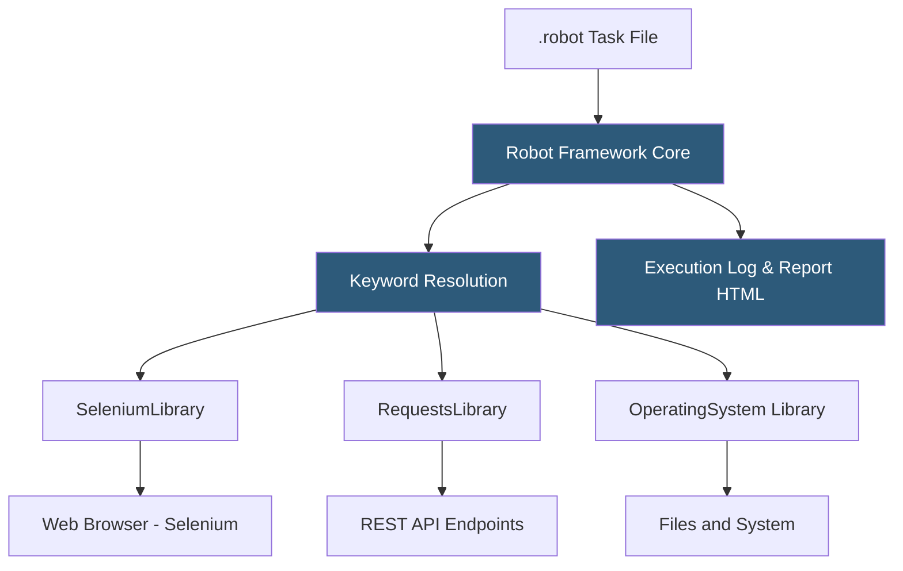

**Category:** RPA (Robotic Process Automation)
**Difficulty:** Intermediate
**Reading time:** 6 min read

---

Robot Framework is an open-source, keyword-driven test automation and RPA framework written in Python. It provides a tabular, human-readable syntax for defining automation tasks using libraries of keywords, with an extensive ecosystem of community libraries covering web automation, APIs, databases, mobile devices, and desktop applications.

- **Keyword** — a named, reusable automation action; keywords are the fundamental building block of Robot Framework scripts
- **Library** — a collection of keywords; standard libraries (Collections, OperatingSystem) ship with Robot Framework; community libraries (SeleniumLibrary, RequestsLibrary) extend it
- **Test Suite** — a `.robot` file containing keyword definitions and automation task specifications
- **Resource File** — a `.robot` file containing only keyword definitions for reuse across multiple suites
- **Variable** — a value holder in Robot Framework; scalar (`${VAR}`), list (`@{LIST}`), and dictionary (`&{DICT}`) types
- **SeleniumLibrary** — the most popular library for web browser automation using Selenium WebDriver bindings
- **Browser Library** — a modern alternative to SeleniumLibrary using Playwright for faster, more reliable browser automation

Robot Framework scripts use a tabular syntax with four-space separation between elements. A `.robot` file contains sections: `*** Settings ***` for library imports, `*** Variables ***` for global values, `*** Keywords ***` for reusable keyword definitions, and `*** Tasks ***` (for RPA) or `*** Test Cases ***` (for testing) containing the executable sequences.

The Robot Framework core parses the file, resolves keyword references to their implementing Python functions (in libraries), and executes them sequentially. The framework handles variable substitution, control flow (IF/ELSE, FOR loops, WHILE loops), exception handling (Run Keyword And Continue On Failure), and setup/teardown for suites and individual tasks.

SeleniumLibrary provides keywords mapping directly to Selenium WebDriver operations: `Open Browser https://example.com chrome`, `Click Element id=submit-button`, `Input Text name=username value=john@example.com`. These keywords drive real browser sessions, making them suitable for automating any web application.

Execution generates human-readable HTML log and report files showing each keyword execution with passed/failed status, captured screenshots on failure, and timing data. These reports serve as both operational logs and compliance documentation.

Robocorp's RPA Framework extends Robot Framework with additional keywords specifically designed for RPA patterns: work item handling, Robocorp Control Room integration, Windows application automation, and Excel operations optimized for RPA workflows.

- Web application automation for data extraction and form submission
- API testing and automation integrated with CI/CD pipelines
- Legacy system automation combined with modern web interfaces
- Cross-platform automation on Windows, Linux, and macOS
- Teams wanting open-source RPA with Python extensibility

| Advantage | Disadvantage |
|-----------|--------------|
| Completely free with massive community library ecosystem | No native visual designer; requires developer comfort with text-based scripting |
| Dual-use for testing and RPA in the same framework | Keyword-driven syntax can become verbose for complex logic |
| Python extensibility enables any custom integration | No built-in orchestration; requires Robocorp, Jenkins, or custom scheduling |
| Excellent reporting built-in for compliance evidence | Less suited for business user automation vs. visual RPA tools |

- [Robocorp Python-Based RPA](robocorp-python-based-rpa.md)
- [TagUI Open-Source RPA](tagui-open-source-rpa.md)
- [Kofax RPA (Kapow)](kofax-rpa-kapow.md)

---
*Part of the [RPA (Robotic Process Automation)](index.md) category · [Back to Master Index](../../index.md)*
