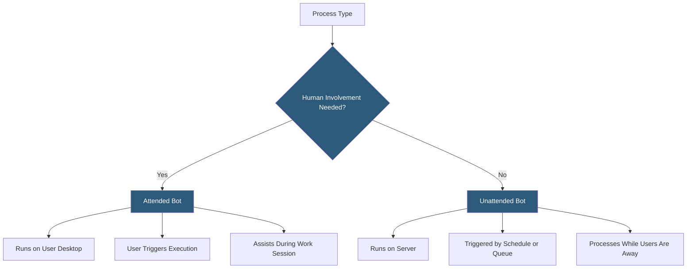

**Category:** RPA (Robotic Process Automation)
**Difficulty:** Beginner
**Reading time:** 5 min read

---

Attended and unattended bots are the two fundamental deployment modes for RPA robots, each suited for distinct automation scenarios. Attended bots collaborate with human workers on their desktops, triggering on user actions and assisting during active work sessions. Unattended bots execute independently on servers without human involvement, processing high volumes of work on schedule or event-driven triggers.

- **Attended Bot** — a robot running on a user's workstation, triggered manually or by application events during the user's working session
- **Unattended Bot** — a robot executing autonomously on server infrastructure without any human involvement in the process
- **Hybrid Bot** — a deployment pattern combining attended and unattended modes within a single process
- **Bot License** — the licensing unit controlling how many robots can run simultaneously; attended and unattended licenses are typically priced separately
- **Robot Trigger** — the mechanism initiating a robot run: user button click (attended), cron schedule, queue item arrival, or API call (unattended)
- **Human-in-the-Loop** — a process pattern where unattended automation handles routine cases and routes exceptions to human review
- **Concurrent Execution** — multiple unattended robots processing different queue items simultaneously to increase throughput

Attended bots install on user workstations alongside the applications users work with daily. They trigger through several mechanisms: a dedicated button in the RPA platform's system tray, a hotkey, a click within a Robotic Desktop Automation overlay UI, or programmatic triggers from the active application (when a case management screen loads, trigger the robot). The robot performs actions visible on screen—navigating applications, filling fields, copying data—while the user waits or shifts to a parallel task. Use cases include contact center agent assistance, desktop data entry support, and guided procedure workflows.

Unattended bots run on server machines or cloud containers without any logged-in user. They connect to an orchestrator (UiPath Orchestrator, Automation Anywhere Control Room, Blue Prism Control Room) that queues work items and dispatches jobs. Multiple unattended robots can run in parallel on different machines, processing queue items concurrently. Typical use cases include overnight batch processing, document extraction queues, system-to-system data reconciliation, and scheduled report generation.

Hybrid patterns chain attended and unattended phases. An attended robot captures data during a customer call (attended phase), submits it to a processing queue, and an unattended robot processes the queue overnight (unattended phase).

Licensing models differ: attended licenses are per-seat and typically include one concurrent execution per machine; unattended licenses are typically priced per concurrent execution or per robot instance.

- Attended: real-time agent assistance in contact centers
- Attended: data entry support across multiple back-end systems during user workflow
- Unattended: high-volume overnight invoice processing
- Unattended: scheduled regulatory report generation
- Hybrid: front-office data capture feeding unattended back-office processing

| Advantage | Disadvantage |
|-----------|--------------|
| Attended bots help users without process re-engineering | Attended bots don't reduce headcount; they reduce effort per user |
| Unattended bots provide 24/7 processing capacity | Unattended bots require more rigorous exception handling design |
| Both modes handle processes not suitable for API automation | Unattended licensing costs grow significantly with scale |
| Hybrid patterns maximize automation coverage | Hybrid architecture complexity increases development and maintenance cost |

- [RPA Center of Excellence (CoE)](rpa-center-of-excellence-coe.md)
- [UiPath Automation Platform](uipath-automation-platform.md)
- [Automation Anywhere Platform](automation-anywhere-platform.md)

---
*Part of the [RPA (Robotic Process Automation)](index.md) category · [Back to Master Index](../../index.md)*
