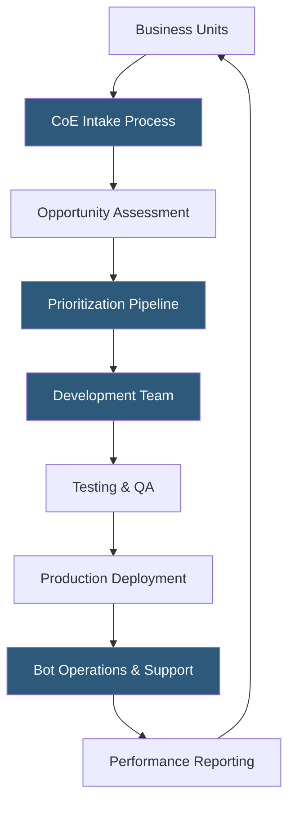

**Category:** RPA (Robotic Process Automation)
**Difficulty:** Intermediate
**Reading time:** 6 min read

---

An RPA Center of Excellence (CoE) is an internal organizational structure that centralizes automation strategy, development standards, governance, and operational oversight for a company's RPA program. It provides the expertise, processes, and tooling that enable business units to identify, prioritize, build, and sustain automations at scale while managing risk and ensuring consistent quality.

- **Pipeline Management** — a structured intake and prioritization process for automation opportunities submitted by business units
- **Development Standards** — coding conventions, design patterns, and reusable component guidelines that CoE enforces across all automations
- **Operating Model** — the organizational design of the CoE: centralized, federated, or hub-and-spoke, each with different autonomy tradeoffs
- **ROI Calculation** — a standardized method for estimating and measuring automation business value (hours saved × cost per hour)
- **Automation Maturity Model** — a framework assessing an organization's RPA program maturity across governance, technology, and operations
- **Bot Lifecycle Management** — the processes governing how bots move from idea through development, testing, deployment, and retirement
- **Citizen Developer** — a non-IT business user trained to build simple attended automations within CoE-provided guardrails

An RPA CoE centralizes critical automation competencies that would otherwise fragment across business units. The intake process provides a standardized form or portal where business analysts and process owners submit automation candidates with basic process descriptions, estimated transaction volumes, and current effort metrics. The CoE assesses each opportunity for technical feasibility (does the process have stable UI and structured data?), strategic fit, and estimated ROI.

A prioritization pipeline ranks approved candidates using a scoring model—typically weighting ROI, strategic alignment, implementation complexity, and risk. A portfolio view displays all queued, in-progress, and deployed automations with key metrics, enabling leadership visibility into automation program progress.

The development team operates with defined standards: naming conventions for variables and activities, exception handling templates, logging requirements, and reusable component libraries. These standards ensure automations are maintainable by any team member, not just the original developer—a common failure mode in unstructured RPA programs where "bot sprawl" creates undocumented robots with single-developer dependencies.

Operations responsibilities include monitoring deployed bots, responding to failures within agreed SLAs, managing scheduled maintenance windows for application upgrades, and retiring obsolete bots. As programs mature, CoEs implement citizen developer programs—training business users to build attended automations within a guardrailed environment, expanding automation coverage without scaling the central development team proportionally.

- Enterprise-scale RPA programs managing 50+ automations across business units
- Establishing governance before rapid bot proliferation creates technical debt
- Measuring and communicating automation ROI to executive stakeholders
- Standardizing development practices across geographically distributed teams
- Managing bot operations and support without creating per-bot specialist silos

| Advantage | Disadvantage |
|-----------|--------------|
| Consistent standards improve bot reliability and maintainability | Centralized CoE creates bottleneck for business unit automation requests |
| Governance prevents unauthorized, unmanaged bot proliferation | CoE setup requires upfront investment in people and processes |
| Standardized ROI measurement enables objective prioritization | Federated models risk inconsistent standards across satellite teams |
| Operations center ensures rapid failure response | Scaling CoE headcount proportionally with automation demand is challenging |

- [RPA Governance Frameworks](rpa-governance-frameworks.md)
- [RPA Attended vs Unattended Bots](rpa-attended-vs-unattended-bots.md)
- [UiPath Orchestrator](uipath-orchestrator.md)

---
*Part of the [RPA (Robotic Process Automation)](index.md) category · [Back to Master Index](../../index.md)*
