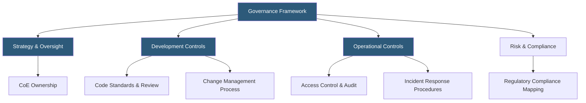

**Category:** RPA (Robotic Process Automation)
**Difficulty:** Intermediate
**Reading time:** 6 min read

---

RPA governance frameworks define the policies, controls, standards, and oversight mechanisms that ensure software robots are developed, deployed, and operated in a controlled, compliant, and risk-aware manner. Effective governance prevents "shadow automation"—uncontrolled bots running without oversight—and addresses the unique risks RPA introduces to data security, process reliability, and regulatory compliance.

- **Change Control** — a formal process for approving, testing, and deploying robot changes to prevent untested modifications reaching production
- **Access Management** — controlling which humans and robots have access to which systems, applying least-privilege principles
- **Bot Identity** — a service account identity assigned to each robot for system access, separate from human user accounts
- **Audit Trail** — a tamper-evident log of all robot actions, decisions, and system interactions for compliance review
- **Business Continuity Plan** — documented procedures for handling robot failures including manual fallback processes
- **Vendor Risk Management** — assessing security and compliance practices of RPA platform vendors handling sensitive process data
- **Data Classification** — categorizing data types processed by robots (PII, financial, regulated) to apply appropriate controls

RPA governance frameworks adapt established IT governance principles (ITIL, COBIT) to the specific characteristics of software robots. Robots access real systems using real credentials and can execute consequential actions—posting journal entries, approving transactions, sending emails—at machine speed. Failures propagate faster than human processes, making preventive controls essential.

Bot identity management assigns each robot a dedicated service account with minimum required permissions. Robots do not share human credentials. Service account passwords rotate on a defined schedule (typically 90 days or shorter for PCI-regulated environments) and are managed through the RPA platform's credential vault rather than embedded in code.

Change control applies to all robot modifications. A robot code change follows the same path as an application change: development, peer review (four-eyes principle), functional testing in a non-production environment, and documented sign-off before production deployment. Emergency change procedures allow accelerated deployment for critical fixes with retrospective review.

Audit trails are fundamental to regulated industry compliance. Every robot action—which record was read, what value was changed, which system was called—records in structured logs. For financial processes, these logs provide the evidence required by SOX auditors. For healthcare robots, they support HIPAA access logging requirements.

Risk categorization classifies automations by impact level (low: read-only reporting bots; high: financial transaction posting bots) and applies proportional controls—high-impact automations require more rigorous testing, wider change approval authority, and more frequent bot operation reviews.

- Establishing governance before enterprise RPA program scales beyond control
- Preparing RPA controls documentation for external audit (SOX, ISO 27001)
- Defining change management procedures for robot maintenance
- Implementing bot identity and access management policies
- Creating incident response runbooks for robot failures in critical processes

| Advantage | Disadvantage |
|-----------|--------------|
| Prevents unmanaged bot proliferation and associated risk | Governance overhead slows automation delivery if overapplied |
| Compliance evidence reduces audit burden in regulated industries | Proportional controls require maturity to calibrate correctly |
| Consistent standards reduce operational support costs | Organizations may resist governance as bureaucratic overhead |
| Incident response procedures reduce failure impact duration | Maintaining governance documentation requires ongoing investment |

- [RPA Center of Excellence (CoE)](rpa-center-of-excellence-coe.md)
- [RPA Attended vs Unattended Bots](rpa-attended-vs-unattended-bots.md)
- [Blue Prism Intelligent Automation](blue-prism-intelligent-automation.md)

---
*Part of the [RPA (Robotic Process Automation)](index.md) category · [Back to Master Index](../../index.md)*
