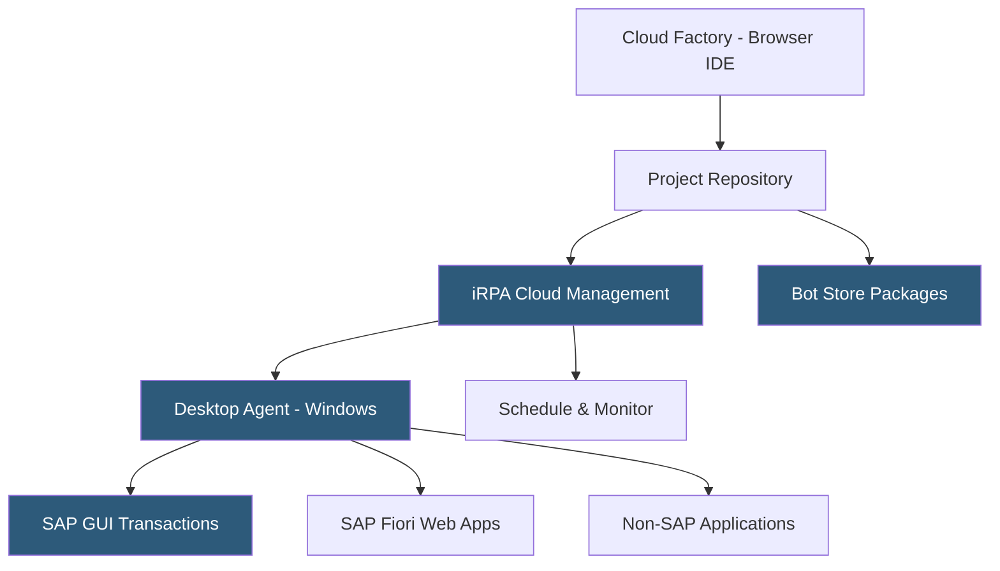

**Category:** RPA (Robotic Process Automation)
**Difficulty:** Intermediate
**Reading time:** 6 min read

---

SAP Intelligent Robotic Process Automation (iRPA) is SAP's native automation platform integrated within SAP Business Technology Platform (BTP), enabling automation of SAP and non-SAP applications. It is particularly effective for automating SAP GUI and SAP Fiori transactions, offering a cloud factory for building automation projects and a dedicated desktop agent for attended and unattended execution.

- **Cloud Factory** — the browser-based SAP iRPA development environment for building automation projects
- **Desktop Agent** — a Windows application installed on robot machines that executes automation projects
- **iRPA SDK** — a JavaScript SDK for building custom automation steps that interact with web and desktop applications
- **SAP GUI Automation** — native support for scripting SAP GUI transactions without custom UI automation libraries
- **Fiori Automation** — built-in recognition of SAP Fiori app components for reliable web automation within SAP systems
- **Bot Store** — SAP's marketplace of pre-built automation packages for common SAP processes (invoice processing, vendor creation)
- **Integration with SAP Process Automation** — the broader SAP workflow automation platform combining iRPA with SAP Workflow Management

SAP iRPA development occurs in the Cloud Factory—a browser-based project builder that provides an SDK environment for writing automation scripts in JavaScript. Projects contain workflows (the sequence of automation steps) and automations (the individual interactions with applications). Developers use the SDK's APIs to control screen interactions, manipulate data, and call SAP APIs.

SAP GUI automation leverages scripting APIs built into SAP GUI for Windows, providing more reliable element targeting than generic screen scraping. The SDK can invoke SAP GUI scripting commands directly—setting transaction codes, accessing specific fields by their technical names (not just visual position), and reading SAP table contents as structured data. This deep integration significantly improves reliability compared to generic UI automation against SAP.

The Desktop Agent installs on Windows machines and registers with the iRPA cloud management system. When a project deploys, the agent downloads it and executes on schedule or via API trigger. For attended scenarios, the agent provides a systray interface that users interact with to trigger bots during their work sessions.

The Bot Store offers pre-built automation packages for standard SAP processes: creating purchase requisitions, processing vendor invoices in MIRO, extracting accounts receivable aging reports, and onboarding new employees in SuccessFactors. These packages provide starting-point automations that teams customize to their specific configuration and data requirements.

- SAP FICO process automation (invoice posting, payment runs, period close)
- SAP MM purchasing automation (PO creation, goods receipt, invoice matching)
- SAP HR mass data changes across employee records
- Non-SAP application integration alongside SAP workflows
- Migrating manual SAP GUI tasks to automated robot execution

| Advantage | Disadvantage |
|-----------|--------------|
| Native SAP GUI and Fiori integration is more reliable | JavaScript SDK requires developer skills, no visual designer |
| Bot Store accelerates SAP process automation | Limited outside SAP ecosystem; weaker for non-SAP applications |
| BTP integration enables SAP workflow orchestration | Smaller community and ecosystem than UiPath or AA |
| SAP support covers automation within SAP licensing discussions | Learning curve for iRPA differs from mainstream RPA tools |

- [Oracle RPA](oracle-rpa.md)
- [Pega Platform RPA](pega-platform-rpa.md)
- [UiPath Automation Platform](uipath-automation-platform.md)

---
*Part of the [RPA (Robotic Process Automation)](index.md) category · [Back to Master Index](../../index.md)*
