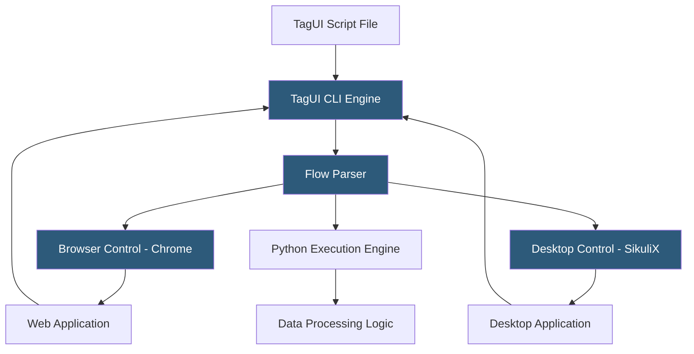

**Category:** RPA (Robotic Process Automation)
**Difficulty:** Beginner
**Reading time:** 5 min read

---

TagUI is a free, open-source RPA tool developed by AI Singapore that automates web, desktop, and mouse/keyboard interactions using a plain-English scripting syntax. It runs on Windows, macOS, and Linux without licensing costs, making it accessible for individuals, small organizations, and educational settings where commercial RPA platforms are cost-prohibitive.

- **TagUI Script** — automation instructions written in near-plain-English syntax (e.g., `click login button`, `type username as john@example.com`)
- **Flow File** — a `.tag` text file containing the TagUI automation script
- **Data Table** — a CSV file that TagUI iterates over, running the same automation steps for each row of data
- **Screenshot** — a built-in command capturing the current screen state for debugging and evidence purposes
- **Python Integration** — TagUI's ability to execute Python code blocks within a flow for complex logic
- **AI Vision** — a computer vision feature using image recognition to interact with UI elements not accessible via standard methods
- **Headless Mode** — running web automation without a visible browser window for server-side execution

TagUI installs via npm (`npm install -g tagui`) or as a standalone package. Flows are plain text files with `.tag` extension. The TagUI engine parses commands line by line and translates them into browser control actions (using Chrome DevTools Protocol), mouse/keyboard actions (using operating system APIs), or Python expressions.

Browser automation is the core capability. Commands like `https://example.com` navigate to a URL; `click Submit` finds a visible button labeled "Submit" and clicks it; `type input#email as user@example.com` types into the email field. TagUI uses multiple element identification strategies: CSS selectors, XPath, visible text content, and image recognition.

Image recognition via the AI Vision feature (integrating SikuliX) enables TagUI to click on UI elements identified by screenshot reference images—useful for legacy desktop applications or thick-client interfaces that don't expose standard accessibility APIs. The user provides a small screenshot of the target element; TagUI locates it on screen at runtime and interacts with it.

Data-driven automation processes CSV tables. A flow referencing `[name]` and `[email]` columns runs once for each row, substituting the column values on each iteration. This enables bulk operations like form filling from a spreadsheet.

Python code blocks (`py` prefix) embed full Python logic within flows, enabling complex data transformation, API calls, and conditional logic that would be verbose in TagUI's own syntax.

- Automating repetitive web form submissions on a budget
- Data extraction (scraping) from websites into CSV files
- Automating legacy desktop applications on any operating system
- Educational RPA demonstrations without licensing costs
- Lightweight automation for small NGOs or individual researchers

| Advantage | Disadvantage |
|-----------|--------------|
| Completely free with no licensing costs | Limited enterprise governance, audit, and management features |
| Cross-platform (Windows, macOS, Linux) | Community support only; no commercial SLA |
| Simple English-like syntax accessible to beginners | Less reliable than commercial tools for complex enterprise processes |
| Python integration enables sophisticated logic | No visual designer; all development in text editor |

- [Robot Framework Automation](robot-framework-automation.md)
- [Robocorp Python-Based RPA](robocorp-python-based-rpa.md)
- [Microsoft Power Automate Desktop](microsoft-power-automate-desktop.md)

---
*Part of the [RPA (Robotic Process Automation)](index.md) category · [Back to Master Index](../../index.md)*
