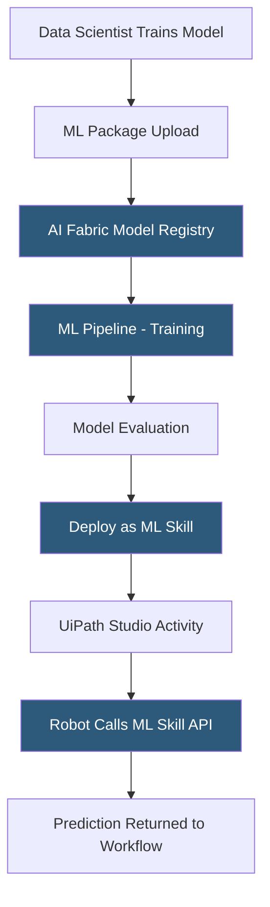

**Category:** RPA (Robotic Process Automation)
**Difficulty:** Advanced
**Reading time:** 7 min read

---

UiPath AI Fabric is the machine learning operations (MLOps) layer of the UiPath platform, enabling data scientists and developers to deploy, manage, and consume ML models directly within RPA workflows. It provides a model deployment pipeline, versioning, A/B testing, and activity packages that call hosted ML models from Studio workflows.

- **ML Skill** — a deployed ML model endpoint exposed as a reusable activity in UiPath Studio
- **ML Package** — a containerized ML model (Python-based) uploaded to AI Fabric for deployment
- **ML Pipeline** — a training or evaluation workflow in AI Fabric that processes data and produces a model artifact
- **Evaluation Dataset** — a labeled dataset used to benchmark model performance before promotion to production
- **Out-of-the-Box Model** — a pre-trained UiPath model (sentiment analysis, named entity recognition) deployable without custom training
- **Custom Model** — a customer-trained model following the UiPath ML Package SDK specification
- **Model Version** — a specific iteration of a deployed model; AI Fabric supports canary rollouts between versions

AI Fabric runs on Kubernetes infrastructure—either hosted in UiPath Automation Cloud or deployed on-premises. Data scientists package ML models following the UiPath ML Package SDK: a Python class implementing `train()`, `predict()`, and optional `evaluate()` methods, plus a `requirements.txt` for dependencies and a schema file defining input/output fields.

The uploaded package appears in the AI Fabric project. A training pipeline runs the `train()` method on configured datasets, producing a model artifact stored in AI Fabric's object storage. An evaluation pipeline runs the `evaluate()` method against a holdout dataset, computing metrics (accuracy, F1 score, mean absolute error) displayed in a comparison dashboard. Teams compare model versions side-by-side before deciding which to promote.

When a model version is deployed as an ML Skill, AI Fabric provisions a Kubernetes pod running the model server with a REST API endpoint. The ML Skill activity in UiPath Studio calls this endpoint synchronously during workflow execution, passing input fields as JSON and receiving predictions. The robot can then use the prediction to make branching decisions—route an invoice to the correct approval workflow based on predicted category, or flag a document as requiring human review based on predicted anomaly score.

Out-of-the-box models (invoice processing, question answering, language detection) are pre-certified by UiPath and deployable without custom training, providing immediate value for common use cases.

- Classifying incoming email types to route to appropriate processing workflows
- Predicting invoice exception likelihood to prioritize validation queues
- Named entity recognition extracting structured data from contract text
- Sentiment scoring customer feedback routed from CRM systems
- Image classification for quality control in manufacturing automation

| Advantage | Disadvantage |
|-----------|--------------|
| Tight integration with UiPath Studio reduces ML deployment friction | Kubernetes infrastructure requirement increases hosting complexity |
| Versioned models enable safe rollouts and rollbacks | ML model development skills separate from RPA developer skills |
| Pre-built models accelerate time to value | Model serving adds latency to robot execution vs. local inference |
| On-premises deployment supports data residency requirements | Additional licensing cost beyond base UiPath platform |

- [UiPath Document Understanding](uipath-document-understanding.md)
- [UiPath Automation Platform](uipath-automation-platform.md)
- [Power Automate AI Builder](power-automate-ai-builder.md)

---
*Part of the [RPA (Robotic Process Automation)](index.md) category · [Back to Master Index](../../index.md)*
