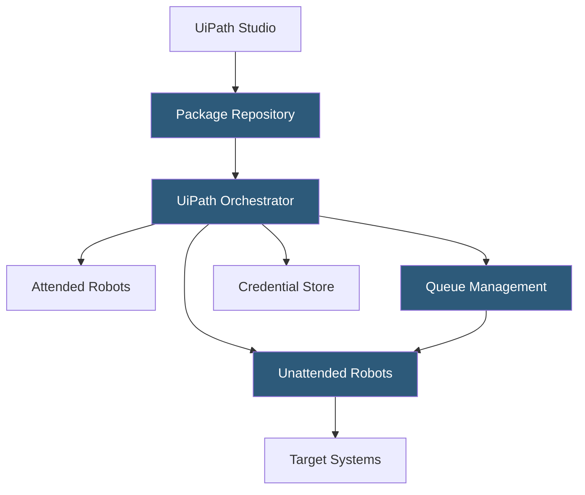

**Category:** RPA (Robotic Process Automation)
**Difficulty:** Intermediate
**Reading time:** 7 min read

---

UiPath is the leading enterprise RPA platform providing tools to design, deploy, manage, and monitor software robots that automate repetitive business processes. Its platform spans attended and unattended automation, AI-powered document processing, process mining, and a cloud-hosted orchestration layer, making it the most comprehensive automation suite in the market.

- **Robot** — a UiPath software agent that executes automation workflows on a Windows machine or in the cloud
- **Workflow** — a visual sequence of automation steps designed in UiPath Studio using a drag-and-drop activity palette
- **Activity** — a pre-built automation action (click, type, read Excel, call API) that forms a building block of a workflow
- **Orchestrator** — the central server managing robot deployments, schedules, queues, credentials, and monitoring
- **Queue** — a distributed work item list that multiple robots can consume in parallel for high-throughput processing
- **UiPath Studio X** — a simplified automation designer for business users who lack programming skills
- **Process Mining** — UiPath's discovery tool that analyzes event logs to identify automation opportunities

UiPath automation development begins in UiPath Studio, where developers design workflows using a visual flowchart or sequential diagram. The activity library provides thousands of pre-built connectors for UI automation (clicking screen elements via selectors), API calls, file operations, data manipulation, and integrations with SAP, Salesforce, and Office 365. Developers publish completed workflows as NuGet packages to the Orchestrator's package repository.

UiPath Orchestrator acts as the central control plane. Robot machines register with Orchestrator and receive machine keys for authenticated communication. When a job triggers—via schedule, API call, Orchestrator UI, or queue item arrival—Orchestrator assigns the job to an available robot, pushes the package, and the robot executes the workflow on the target machine.

For high-volume processes, queues distribute work across multiple robot instances. A feeder process adds transaction items (invoice records, order IDs) to an Orchestrator queue. Multiple unattended robots consume queue items in parallel, each processing a work unit and reporting success or failure back to Orchestrator. This pattern scales processing throughput linearly with robot count.

Credential management in Orchestrator stores passwords and API keys in an encrypted vault, injecting credentials into workflows at runtime without embedding them in code. Audit logs record every robot action, job result, and exception, providing compliance evidence for regulated industries.

- Invoice processing and accounts payable automation
- HR onboarding data entry across multiple HR systems
- Customer order status checking and email response generation
- ERP data migration and reconciliation tasks
- Regulatory report generation from multiple data sources

| Advantage | Disadvantage |
|-----------|--------------|
| Largest activity library and community ecosystem | Enterprise licensing cost is significant |
| Robust Orchestrator for enterprise-scale deployments | Steep learning curve for complex automation development |
| AI and document understanding built into platform | UI-based automation is brittle when application UIs change |
| Strong governance with role-based access controls | Resource-heavy robots require dedicated VM infrastructure |

- [UiPath Orchestrator](uipath-orchestrator.md)
- [UiPath Studio Workflow Designer](uipath-studio-workflow-designer.md)
- [RPA Attended vs Unattended Bots](rpa-attended-vs-unattended-bots.md)

---
*Part of the [RPA (Robotic Process Automation)](index.md) category · [Back to Master Index](../../index.md)*
