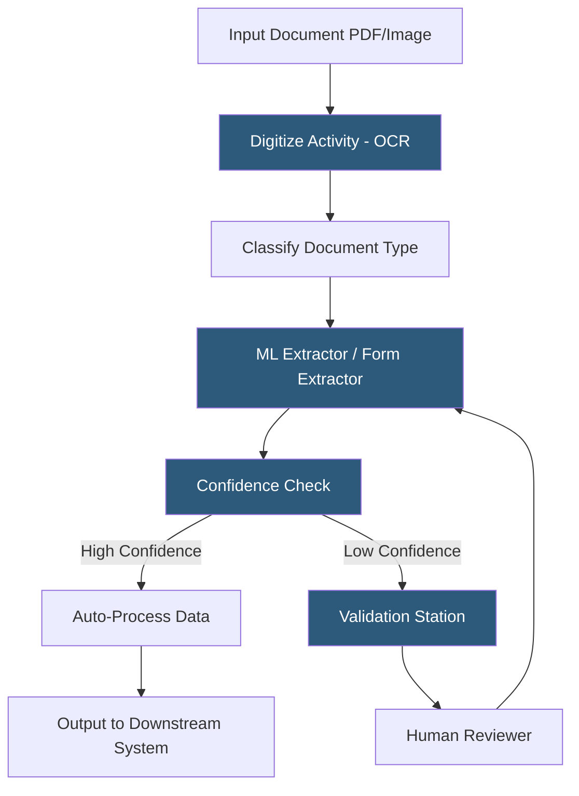

**Category:** RPA (Robotic Process Automation)
**Difficulty:** Advanced
**Reading time:** 7 min read

---

UiPath Document Understanding is an AI-powered document processing framework that enables robots to extract structured data from semi-structured and unstructured documents—invoices, purchase orders, contracts, and forms—using machine learning models combined with OCR and human validation workflows. It bridges the gap between traditional RPA's reliance on structured data and the document-heavy reality of business processes.

- **Digitization** — the OCR step converting scanned images or PDFs into machine-readable text with positional metadata
- **Taxonomy** — a schema defining the document types and fields a model will classify and extract
- **ML Extractor** — a trained machine learning model that identifies and extracts field values from document regions
- **Form Extractor** — a rule-based extractor using positional anchors for highly structured, fixed-layout forms
- **Validation Station** — a human-in-the-loop UiPath activity presenting low-confidence extractions to a human reviewer
- **Training Pipeline** — a continuous learning workflow where human corrections improve model accuracy over time
- **Confidence Score** — a 0–1 value indicating the model's certainty for each extracted field, used to route low-confidence items to validation

Document Understanding workflows begin with digitization. The Digitize Document activity passes the input file to an OCR engine—UiPath integrates with OmniPage, Google Document AI, Microsoft Azure OCR, and its own UiPath OCR—producing a Document Object Model with word positions, confidence scores, and page geometry.

Classification determines the document type (invoice, purchase order, delivery note) using either a keyword-based classifier or an ML classifier trained on document samples. The identified document type maps to a taxonomy definition specifying which fields to extract (vendor name, invoice number, line items, total amount).

The ML Extractor applies a trained model to extract field values from the digitized document. For each field, the model returns the extracted text and a confidence score. The workflow evaluates confidence against configurable thresholds—typically 0.8 for standard fields and 0.95 for financial amounts. Fields falling below threshold are flagged for human validation.

Validation Station presents flagged documents in a structured review interface. A human operator confirms or corrects extractions, which the system logs as training samples. A retraining pipeline periodically re-trains the ML model on accumulated human corrections, improving accuracy over time—a continuous learning loop that typically reaches 90%+ straight-through processing rates within three to six months.

Extracted data integrates with downstream systems via standard UiPath activities: writing to SAP, posting to REST APIs, or inserting into databases.

- Automated accounts payable invoice processing
- Customs document processing for logistics and freight
- Insurance claim document extraction and routing
- Bank loan application document verification
- Healthcare prior authorization form processing

| Advantage | Disadvantage |
|-----------|--------------|
| Handles semi-structured documents traditional RPA cannot | Significant ML training effort required for high accuracy |
| Human-in-the-loop validation prevents costly errors | Requires labeled training data to bootstrap ML models |
| Continuous learning improves accuracy without redevelopment | OCR quality bottleneck for poor-quality scanned documents |
| Integrates natively with UiPath RPA workflows | Per-page consumption pricing adds to operating costs |

- [UiPath AI Fabric](uipath-ai-fabric.md)
- [Automation Anywhere IQ Bot](automation-anywhere-iq-bot.md)
- [Blue Prism Decipher IDP](blue-prism-decipher-idp.md)

---
*Part of the [RPA (Robotic Process Automation)](index.md) category · [Back to Master Index](../../index.md)*
