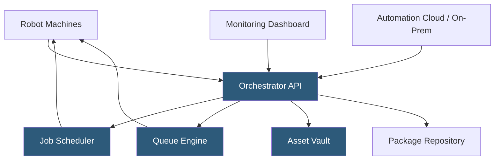

**Category:** RPA (Robotic Process Automation)
**Difficulty:** Intermediate
**Reading time:** 6 min read

---

UiPath Orchestrator is the centralized management and control plane for UiPath robot deployments, providing scheduling, queue management, credential storage, monitoring, and governance across an organization's entire automation estate. It is available as a cloud-hosted SaaS service (Automation Cloud) or as an on-premises installation on Windows Server.

- **Tenant** — an isolated organizational unit within Orchestrator with its own robots, users, assets, and queues
- **Folder** — a logical container within a tenant organizing robots, packages, and jobs by team or process area
- **Machine Template** — a configuration defining the runtime environment (type, version) for robot deployment
- **Asset** — a named, encrypted value (credential, text, integer) stored in Orchestrator and injected into workflows at runtime
- **Trigger** — a time-based or queue-based rule that automatically starts a job when conditions are met
- **Queue** — a distributed work item store enabling multiple robots to process transaction items in parallel
- **Webhook** — an HTTP callback configuration that fires external API calls on Orchestrator events (job completed, job failed)

Orchestrator operates as a web application backed by a SQL Server database (on-premises) or a managed cloud database (Automation Cloud). Robot machines establish persistent HTTPS connections to Orchestrator using machine keys—unique tokens generated per machine template. This connection enables Orchestrator to push job commands and receive heartbeat and status updates from robots.

When a job trigger fires—either on a configured cron schedule or when a queue item arrives—Orchestrator evaluates the allocation policy to identify an available robot. For unattended robots, it selects a machine with a free robot license, pushes the package reference, and signals the robot to begin execution. The robot downloads the package from Orchestrator's NuGet repository if not locally cached and begins execution.

Queue processing enables parallel workloads. A dispatcher robot (or external system) adds transaction items to a queue with a JSON payload describing the work unit. Multiple consumer robots listen for available items, lock one item at a time (preventing duplicate processing), execute the workflow for that item, and report the outcome (Successful, Failed, BusinessException) back to Orchestrator. Failed items can be automatically retried a configurable number of times.

Assets provide secure credential injection. A workflow references an asset by name; at runtime, Orchestrator injects the stored value without exposing it in logs or code. Credential assets are stored encrypted using AES-256 and support per-robot value variation, so each robot can use different credentials for the same process.

- Scheduling unattended nightly batch processing across robot fleets
- Distributing high-volume invoice processing across multiple robots
- Managing credentials for hundreds of automation workflows centrally
- Monitoring automation performance and exception rates via dashboards
- Triggering automations via REST API from external business systems

| Advantage | Disadvantage |
|-----------|--------------|
| Centralized governance across all automations and robots | Complex setup and maintenance for on-premises deployments |
| Queue-based parallelism scales processing throughput | SQL Server database is a single point of failure on-premises |
| Secure asset vault eliminates hardcoded credentials | Cloud (Automation Cloud) introduces data residency considerations |
| Webhook integration enables event-driven architecture | Per-robot licensing costs grow significantly at scale |

- [UiPath Automation Platform](uipath-automation-platform.md)
- [Automation Anywhere Control Room](automation-anywhere-control-room.md)
- [RPA Center of Excellence (CoE)](rpa-center-of-excellence-coe.md)

---
*Part of the [RPA (Robotic Process Automation)](index.md) category · [Back to Master Index](../../index.md)*
