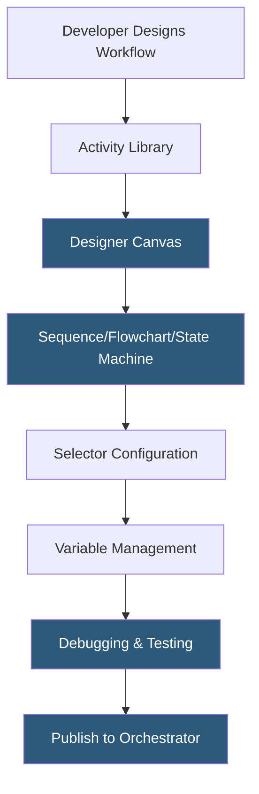

**Category:** RPA (Robotic Process Automation)
**Difficulty:** Beginner
**Reading time:** 5 min read

---

UiPath Studio is the integrated development environment (IDE) for building RPA workflows, providing a drag-and-drop visual designer, a rich activity library, debugging tools, and version control integration. It compiles automation logic into executable packages deployable to UiPath Orchestrator or run directly on desktop machines by attended robots.

- **Sequence** — a linear workflow container executing activities in order, used for simple step-by-step automations
- **Flowchart** — a branching workflow container supporting conditional logic and loops, suited for complex decision flows
- **State Machine** — a workflow pattern modeling processes as states and transitions, ideal for long-running interactive workflows
- **Selector** — an XML-based identifier describing a UI element by its attributes (class, title, id) for reliable targeting
- **Activity** — a pre-built automation action dragged onto the designer canvas representing one automation step
- **Variable** — a typed data container (String, Int32, DataTable) holding values passed between activities in a workflow
- **UiPath Studio X** — a simplified version of Studio designed for business users without programming backgrounds

UiPath Studio operates as a Windows desktop application. Developers begin by selecting a workflow template—sequence for linear processes, flowchart for branching logic—and drag activities from the Activities panel onto the designer canvas. Each activity represents one automated action: "Type Into" types text into a UI field, "Click" clicks a button or link, "Get Text" extracts visible text from a UI element, "Read Range" reads data from an Excel spreadsheet.

UI automation activities interact with application windows using selectors. When a developer uses the UI Explorer tool to identify a UI element, Studio generates a selector XML string capturing stable properties of that element (window title, control type, automation ID). At runtime, the robot uses the selector to locate the element in the live application, making automation resilient to minor layout changes while remaining fragile to significant UI redesigns.

The Variable panel manages typed variables scoped to a workflow or sequence. Complex data structures like DataTables hold tabular data extracted from databases or Excel sheets and iterated with "For Each Row" activities. Arguments pass data between parent and child workflows in a modular design.

Debugging tools include step-over execution, breakpoints, and the Immediate panel for evaluating expressions at runtime. Studio integrates with Git for version control. When development is complete, developers publish the project to Orchestrator as a versioned NuGet package, available for deployment to robot machines.

- Building attended automation that assists users during active work
- Developing unattended batch processes for overnight data processing
- Creating reusable library activities shared across automation projects
- Automating web browser interactions with Chrome, Edge, or Firefox
- Integrating SAP, Salesforce, and Office 365 through built-in activities

| Advantage | Disadvantage |
|-----------|--------------|
| Visual design lowers barrier for non-developers | Complex workflows become difficult to maintain visually |
| Largest pre-built activity library in the industry | Windows-only; no native macOS or Linux robot support |
| Powerful selector-based UI automation | Selector fragility when target applications update their UI |
| Integrated debugging speeds development cycles | Studio X has significant feature limitations vs. full Studio |

- [UiPath Automation Platform](uipath-automation-platform.md)
- [UiPath Orchestrator](uipath-orchestrator.md)
- [Robot Framework Automation](robot-framework-automation.md)

---
*Part of the [RPA (Robotic Process Automation)](index.md) category · [Back to Master Index](../../index.md)*
