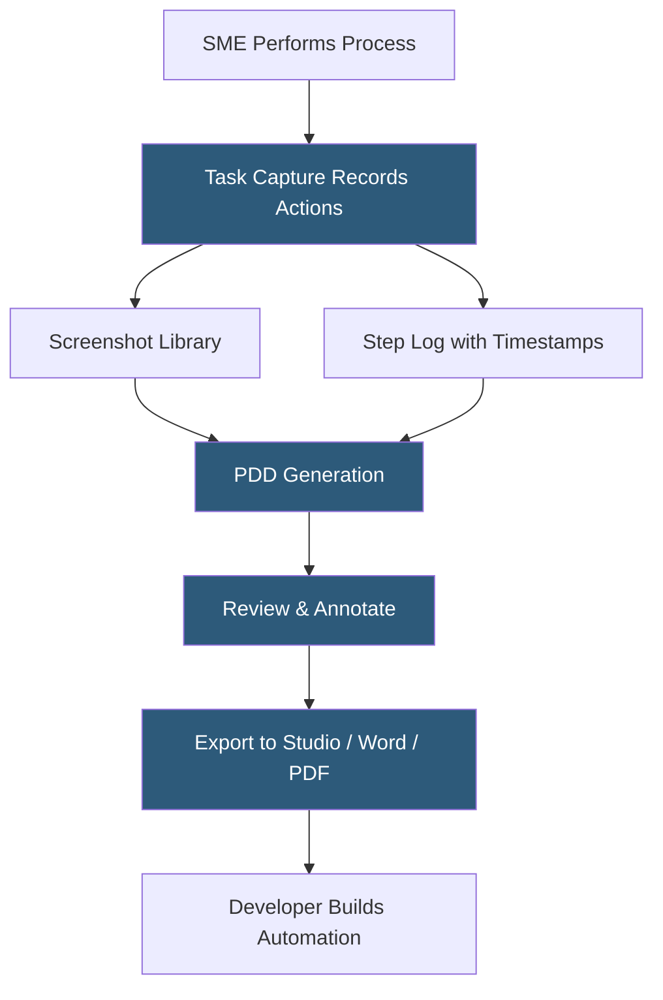

**Category:** RPA (Robotic Process Automation)
**Difficulty:** Beginner
**Reading time:** 5 min read

---

UiPath Task Capture is a process documentation tool that automatically records user actions on a computer and generates detailed process documentation—including step-by-step screenshots, descriptions, and decision points—that serves as the foundation for automation development. It accelerates the discovery and documentation phase of RPA projects by capturing processes as workers perform them.

- **Process Recording** — the act of Task Capture observing and logging all user interactions (clicks, keystrokes, navigation) during a business process
- **PDD (Process Definition Document)** — the structured output document Task Capture generates, describing each step for automation developers
- **Screenshot Annotation** — automatic capture of screen states at each step with UI element highlights showing what was interacted with
- **Decision Point** — a branching step in the recorded process where the user made a choice that Task Capture flags for developer attention
- **XAML Export** — the ability to export a recorded process directly as a UiPath Studio workflow skeleton for developer refinement
- **Collaboration Mode** — multiple team members contributing process recordings that merge into a single unified process document
- **Application Discovery** — automatic detection of which applications were used during the recording for system inventory

Task Capture runs as a lightweight desktop agent on the subject matter expert's (SME) machine. The SME starts a recording session, then performs the business process normally—navigating web browsers, entering data into forms, copy-pasting between applications, generating reports. Task Capture monitors all keyboard and mouse events at the OS level and captures screenshots after each interaction.

Upon recording completion, Task Capture processes the raw event log into a structured process definition. Each step receives a description generated from the captured action (e.g., "Click on 'Submit' button in Invoice Portal"), a screenshot showing the UI state at that moment, and the application context. The tool automatically identifies decision points where the user's behavior varied or where conditional logic appeared.

The generated PDD can be exported in multiple formats: a Microsoft Word document for business review and sign-off, a PDF for archival, or a XAML skeleton that imports directly into UiPath Studio. The XAML export creates an empty workflow with activity placeholders for each recorded step, giving developers a structural starting point that matches the documented process flow.

Teams use Task Capture in process discovery workshops where SMEs record their work while automation developers observe. The generated documentation reduces the requirements-gathering phase from weeks to hours.

- Documenting processes before automation development begins
- Capturing process variations across different SMEs for comparison
- Creating compliance documentation of current-state manual processes
- Generating developer handoff documentation for automation projects
- Building institutional knowledge repositories for business processes

| Advantage | Disadvantage |
|-----------|--------------|
| Dramatically reduces documentation time vs. manual write-ups | Recorded processes may not represent all edge cases and exceptions |
| XAML export accelerates Studio workflow development | Requires SME time for recording sessions |
| Standardizes documentation format across the organization | Screenshots contain potentially sensitive data requiring review |
| Non-technical SMEs can contribute to RPA projects | Complex processes with many branches are hard to capture fully |

- [UiPath Studio Workflow Designer](uipath-studio-workflow-designer.md)
- [RPA Center of Excellence (CoE)](rpa-center-of-excellence-coe.md)
- [RPA Governance Frameworks](rpa-governance-frameworks.md)

---
*Part of the [RPA (Robotic Process Automation)](index.md) category · [Back to Master Index](../../index.md)*
