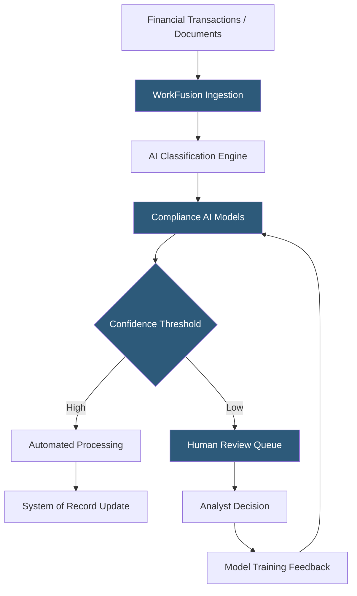

**Category:** RPA (Robotic Process Automation)
**Difficulty:** Advanced
**Reading time:** 6 min read

---

WorkFusion is an AI-powered intelligent automation platform specializing in financial services and compliance-intensive use cases. It combines RPA with purpose-built AI models for anti-money laundering (AML), Know Your Customer (KYC), sanctions screening, and trade operations—positioning itself as a vertical AI automation solution rather than a general-purpose RPA platform.

- **AI Digital Worker** — a pre-built, domain-specific automation combining RPA with trained AI models for a specific compliance or financial process
- **Control Tower** — WorkFusion's orchestration and monitoring platform managing bot deployments and process oversight
- **Intelligent Document Processing (IDP)** — WorkFusion's ML-based document extraction capability trained on financial documents
- **STP Rate** — Straight-Through Processing rate; the percentage of transactions processed automatically without human intervention
- **Compliance AI** — WorkFusion's pre-trained AI models for AML alert investigation, customer risk scoring, and sanctions screening
- **Auto-Coding** — a machine learning feature that automatically assigns classification codes to transactions based on historical patterns
- **Hybrid Intelligence** — WorkFusion's model combining automated processing with human review queues for exception handling

WorkFusion's differentiation lies in pre-trained AI models for specific financial industry use cases. Rather than providing a general ML training pipeline, WorkFusion delivers Digital Workers—packaged automation solutions combining RPA workflows with industry-trained AI—for processes like AML alert investigation, customer due diligence, and transaction monitoring.

For an AML alert investigation Digital Worker, the system receives an alert from a transaction monitoring system, uses RPA to gather additional information (account transaction history, customer profile data, adverse media results), applies a trained AI model to assess the alert's risk based on patterns from thousands of similar historical cases, and generates a disposition recommendation with evidence documentation. Analysts review high-risk or uncertain cases in a structured review interface, and their decisions feed the model's continuous learning pipeline.

The IDP component processes identity verification documents, financial statements, and regulatory filings—extracting structured data and classifying document types using models trained specifically on financial services document formats.

Control Tower provides deployment management, real-time processing dashboards showing STP rates per process, exception queue depths, and SLA compliance. Compliance reporting tracks every automated decision with the model version, input data, and output recommendation for regulatory audit purposes.

WorkFusion targets operations teams in banking, insurance, and asset management where regulatory requirements make both accuracy and audit traceability non-negotiable.

- AML transaction alert investigation and disposition
- KYC customer due diligence document processing
- Sanctions screening and adverse media research automation
- Trade operations exception management
- Regulatory reporting data aggregation for compliance

| Advantage | Disadvantage |
|-----------|--------------|
| Pre-trained financial AI models accelerate time to value | Limited to financial services; not a general-purpose RPA platform |
| Compliance audit trail built for regulatory requirements | Higher cost than general RPA platforms |
| Vertical expertise in AML/KYC processes reduces customization | Less flexible for non-financial use cases |
| Continuous learning improves STP rates over time | Implementation requires deep compliance domain knowledge |

- [Pega Platform RPA](pega-platform-rpa.md)
- [Blue Prism Intelligent Automation](blue-prism-intelligent-automation.md)
- [UiPath Document Understanding](uipath-document-understanding.md)

---
*Part of the [RPA (Robotic Process Automation)](index.md) category · [Back to Master Index](../../index.md)*
