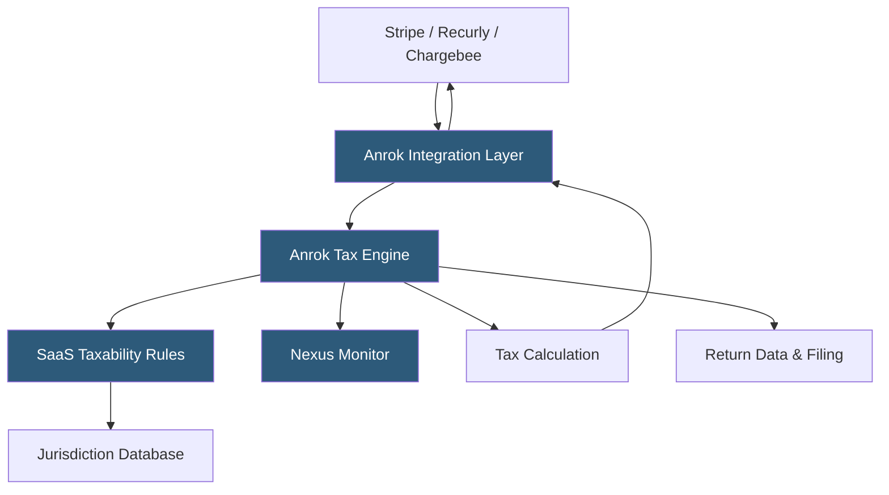

**Category:** Sales Tax & Indirect Tax
**Difficulty:** Intermediate
**Reading time:** 6 min read

---

Anrok is a modern sales tax platform built specifically for SaaS and software companies, addressing the unique complexity of digital goods taxability across US states and global jurisdictions. It integrates natively with SaaS billing platforms (Stripe, Recurly, Chargebee) and subscription management systems to calculate and manage sales tax on software subscriptions, professional services, and digital products.

- **SaaS Taxability** — the state-by-state determination of whether software-as-a-service subscriptions are taxable (varies widely; some states tax SaaS, others exempt it)
- **Billing Platform Integration** — native API connections with Stripe Billing, Recurly, Chargebee, and Zuora for embedded tax calculation
- **Nexus Monitoring** — tracking revenue and customer thresholds by state to detect when economic nexus is established
- **Digital Goods Rules** — jurisdiction-specific taxability rules for downloaded software, streaming services, and electronically delivered products
- **Professional Services Tax** — tracking the varying taxability of implementation, training, and consulting services by state
- **US + Global Coverage** — unified platform handling US sales tax alongside EU VAT and other international indirect taxes
- **Exemption Certificate Workflow** — collecting and validating B2B exemption certificates within the billing flow

Anrok was designed from the ground up for the subscription software business model. Unlike general-purpose tax engines that require product taxonomy mapping to generic categories, Anrok's rules engine natively understands SaaS product types: software subscriptions, professional services bundles, usage-based tiers, and digital content.

The platform integrates with SaaS billing stacks via native connectors. A Stripe Billing integration means Anrok intercepts the invoice creation event, calculates tax based on the customer's billing address and the product type, and adds the tax line item to the Stripe invoice—all before the invoice is finalized and sent to the customer.

SaaS taxability determination is Anrok's core differentiator. Each state has different rules: Texas taxes SaaS at 6.25% if accessed from Texas, but treats cloud-hosted software differently from downloaded software; New York has complex rules distinguishing pre-written software from custom software; some states (Oregon, New Hampshire) have no sales tax entirely. Anrok maintains this matrix and applies the correct rule automatically.

Nexus monitoring tracks SaaS revenue by state and alerts when economic nexus thresholds approach. Since SaaS companies often sell nationally from day one, nexus monitoring is critical—a $10M ARR SaaS company may have nexus in 30+ states.

- SaaS companies calculating tax on monthly and annual software subscriptions
- Software companies managing the US + EU VAT compliance lifecycle
- Companies needing accurate digital goods taxability without custom ERP integration
- Startups wanting to embed tax compliance in their billing stack from launch
- SaaS businesses tracking economic nexus as they scale revenue across states

| Advantage | Disadvantage |
|-----------|--------------|
| SaaS-native rules eliminate generic product taxonomy mapping | Specialized for software/digital; not suitable for physical goods businesses |
| Native billing platform integrations reduce implementation time | Smaller company with narrower enterprise feature set than Avalara |
| Modern API design speeds developer integration | US + limited international coverage vs. comprehensive global platforms |
| Economic nexus monitoring built for subscription revenue models | Limited standalone filing management vs. full managed services |

- [Stripe Tax Integration](stripe-tax-integration.md)
- [TaxJar Sales Tax Engine](taxjar-sales-tax-engine.md)
- [Multi-State Nexus Tracking](multi-state-nexus-tracking.md)

---
*Part of the [Sales Tax & Indirect Tax](index.md) category · [Back to Master Index](../../index.md)*
