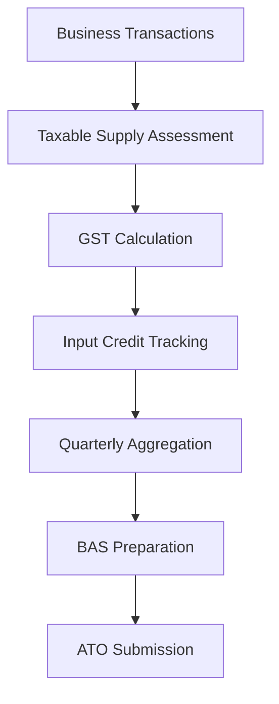

**Category:** Sales Tax & Indirect Tax
**Difficulty:** Intermediate
**Reading time:** 6 min read

---

Australia GST compliance involves managing the 10% Goods and Services Tax across the country. The system requires registration, quarterly returns to the ATO, and input tax credit tracking for all GST-registered businesses.

- **GST Rate** — 10% applied to taxable supplies in Australia
- **GST Registration** — required for businesses with annual turnover exceeding $75,000
- **Input Tax Credits** — GST paid on business purchases
- **Taxable Supply** — goods and services subject to GST
- **ATO Return** — Australian Tax Office quarterly GST return

Australia's GST operates on a standard 10% rate applied to most supplies. Businesses with annual turnover above $75,000 must register with the Australian Tax Office (ATO). The system tracks all GST-taxable supplies sold and input GST paid on business purchases. Registered businesses file quarterly Business Activity Statements (BAS) showing total GST collected (output tax) less total GST paid (input tax), remitting the net amount. The ATO bases GST allocation on the supply place, with special rules for imported goods and cross-border services. The system must categorize supplies correctly, as some items are zero-rated (exports) or exempt (financial services), affecting input tax credit eligibility.

- Managing GST for Australian business operations
- Claiming input tax credits on business expenses
- Filing quarterly BAS with ATO
- Handling export sales and zero-rated items
- Managing GST for imported goods

| Advantage | Disadvantage |
|-----------|--------------|
| Single 10% rate simplifies calculation | Registration threshold creates complexity |
| Input credits improve cash flow | Quarterly filing frequency |
| Established system with ATO support | Record-keeping intensity required |
| Clear export zero-rating rules | Technology integration for reporting |
| Consistent framework nationally | Exemption classification can be complex |

- [GST (Goods and Services Tax)](gst-goods-and-services-tax.md)
- [Canada GST/HST compliance](canada-gst-hst-compliance.md)
- [India GST compliance platforms](india-gst-compliance-platforms.md)

---
*Part of the [Sales Tax & Indirect Tax](sales-tax-indirect-tax/index.md) category · [Back to Master Index](../../index.md)*
