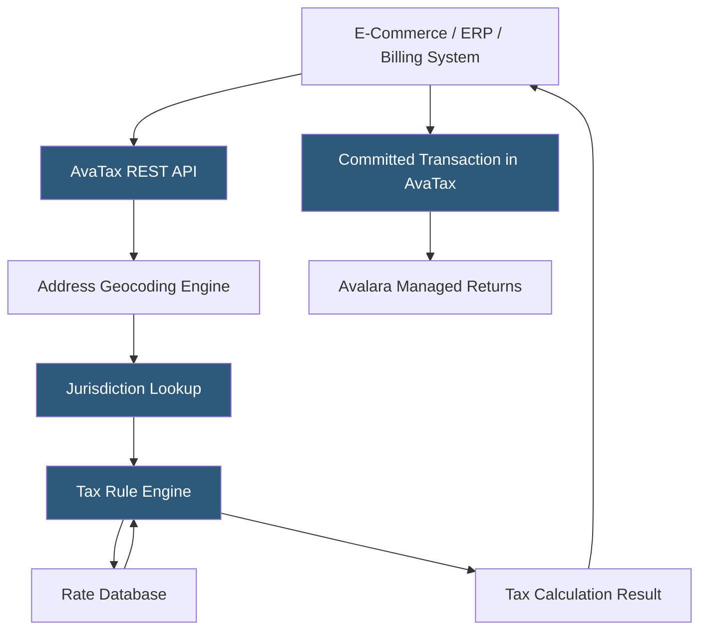

**Category:** Sales Tax & Indirect Tax
**Difficulty:** Intermediate
**Reading time:** 7 min read

---

Avalara AvaTax is the leading cloud-based sales tax calculation engine used by over 30,000 businesses to automatically determine accurate tax rates, rules, and amounts for transactions in real time. It integrates with ERPs, e-commerce platforms, and billing systems via REST API, applying jurisdiction-specific tax logic across all US states and international territories at checkout and invoicing.

- **Tax Calculation API** — a REST endpoint accepting transaction details (origin, destination, line items) and returning per-line tax amounts in milliseconds
- **Nexus** — a legal connection between a business and a taxing jurisdiction creating a tax collection obligation; AvaTax stores a company's nexus declarations
- **Tax Code** — a classification code assigned to products determining their taxability (e.g., P0000000 for tangible personal property, SW052003 for SaaS)
- **Address Validation** — AvaTax's geocoding service resolving addresses to precise tax jurisdictions including special taxing districts
- **Transaction** — a committed or uncommitted record in AvaTax representing a sale or purchase with calculated tax amounts
- **Exemption Certificate** — a document exempting a customer from sales tax; AvaTax validates and stores these through its CertCapture module
- **AvaTax SDK** — client libraries for .NET, Java, Python, PHP, JavaScript enabling API integration without raw HTTP handling

AvaTax integrates with transactional systems through its REST API. When a checkout or invoice event occurs, the calling system sends a CreateTransaction request containing the seller's address (origin), ship-to address (destination), line items with quantities and amounts, customer exemption codes, and product tax codes. AvaTax's geocoding engine resolves both addresses to precise tax jurisdictions—accounting for state, county, city, and special taxing districts that overlay base jurisdictions.

The jurisdiction lookup identifies which taxing authorities apply to the transaction based on the resolved addresses and the company's nexus configuration. Only jurisdictions where the company has declared nexus generate tax obligations; other jurisdictions pass through untaxed. The tax rule engine then evaluates each line item against the jurisdiction's rules: is this product taxable in this jurisdiction? Are there rate exceptions for specific product categories? Does the customer have a valid exemption certificate?

AvaTax maintains a continuously updated rate and rule database—with over 12,000 US tax jurisdictions and rules changing constantly due to legislation—that Avalara's tax research team keeps current. Customers are insulated from the complexity of tracking rate changes themselves.

Committed transactions record in AvaTax's system as a permanent ledger. This transaction data feeds Avalara Managed Returns, where Avalara prepares and files sales tax returns on behalf of the business across all registered jurisdictions.

- E-commerce checkout tax calculation across multi-state shipping
- SaaS subscription billing with correct digital services taxability
- ERP-level tax calculation for B2B sales with exemption certificate management
- Marketplace sellers needing accurate tax across all ship-to states
- International businesses calculating VAT and GST on cross-border sales

| Advantage | Disadvantage |
|-----------|--------------|
| Real-time accurate calculation across 12,000+ jurisdictions | Per-transaction pricing makes high-volume scenarios expensive |
| Avalara maintains rate updates eliminating internal research burden | Integration complexity requires developer effort for each connected system |
| CertCapture automates exemption certificate collection and validation | Over-reliance on AvaTax can create knowledge gaps in internal tax staff |
| Robust SDK ecosystem for major platforms and languages | Subscription cost is significant for small businesses |

- [Avalara Managed Returns](avalara-managed-returns.md)
- [TaxJar Sales Tax Engine](taxjar-sales-tax-engine.md)
- [Vertex Sales Tax O Series](vertex-sales-tax-o-series.md)

---
*Part of the [Sales Tax & Indirect Tax](index.md) category · [Back to Master Index](../../index.md)*
