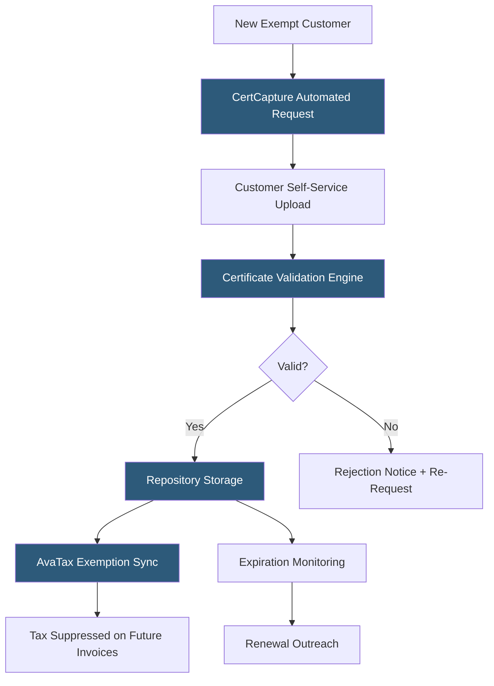

**Category:** Sales Tax & Indirect Tax
**Difficulty:** Intermediate
**Reading time:** 6 min read

---

Avalara CertCapture is a cloud-based exemption certificate management platform that automates the collection, validation, storage, and retrieval of sales tax exemption certificates from customers. It reduces the manual burden of managing certificate expiration, renewals, and audit requests while connecting validated exemptions directly to AvaTax to suppress tax on eligible transactions.

- **Exemption Certificate** — a document (resale certificate, direct pay permit, government exemption) provided by a buyer to exempt a transaction from sales tax
- **Certificate Validity** — the assessment of whether a certificate is properly completed, signed, appropriate for the jurisdiction, and not expired
- **Automated Outreach** — CertCapture's system for automatically requesting certificates from customers via email with a self-service upload link
- **Nexus-Certificate Matrix** — a mapping of which certificates are valid in which states, used to validate that a buyer's certificate applies to the seller's nexus state
- **Certificate Repository** — the central searchable database of all collected certificates accessible for audit responses
- **Expiration Management** — automated tracking and renewal outreach for certificates approaching their validity end date
- **AvaTax Integration** — the link between CertCapture's validated exemptions and AvaTax's tax suppression logic

CertCapture centralizes the exempt certificate workflow that many businesses handle through email and shared drives. When a new B2B customer requests tax-exempt billing, CertCapture sends an automated email with a branded self-service portal link. The customer uploads their certificate (resale certificate, direct pay permit, manufacturer's exemption) through the portal, which guides them to upload the correct certificate type for each state where they will purchase.

The validation engine checks each uploaded certificate against a rules library: Is it the correct form for the issuing state? Are all required fields (buyer name, reason code, authorized signature) completed? Does the certificate type match the buyer's stated reason for exemption? Are there known issues with this certificate format? Certificates failing validation generate automatic rejection notifications with specific correction guidance, prompting the customer to resubmit.

Valid certificates store in the repository indexed by customer, state, and certificate type. CertCapture syncs validated exemptions to AvaTax in near real-time—when the customer places their next order, AvaTax suppresses tax automatically without requiring manual review.

Expiration monitoring scans the repository for certificates approaching their validity date. Many resale certificates in states like California are valid indefinitely; others expire every one to three years. For expiring certificates, CertCapture automatically sends renewal requests to customers, maintaining compliance without manual calendar tracking.

- B2B manufacturers collecting resale certificates from distributor customers
- Wholesale distributors managing certificates from hundreds of retail customers
- Government contractors collecting direct pay permits and government exemptions
- Technology companies collecting SaaS and digital goods exemption certificates
- Any business needing documented evidence of exempt sale support for audits

| Advantage | Disadvantage |
|-----------|--------------|
| Automated outreach eliminates manual certificate chasing | Subscription cost significant for businesses with few exempt customers |
| Self-service portal improves customer certificate submission rates | Certificate validation rules require maintenance as state requirements change |
| Audit-ready repository with historical document preservation | Integration complexity between CertCapture and non-AvaTax billing systems |
| Automatic expiration management prevents lapsed exemptions | Customers may still submit incorrect certificates requiring multiple attempts |

- [Avalara AvaTax Platform](avalara-avatax-platform.md)
- [Sales Tax Exemption Management](sales-tax-exemption-management.md)
- [Resale Certificate Management](resale-certificate-management.md)

---
*Part of the [Sales Tax & Indirect Tax](index.md) category · [Back to Master Index](../../index.md)*
