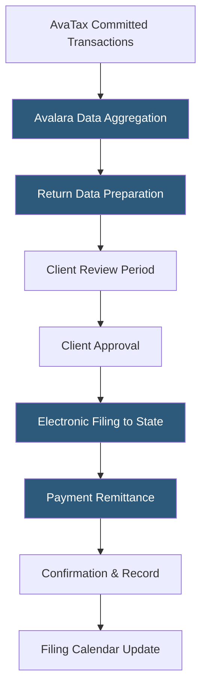

**Category:** Sales Tax & Indirect Tax
**Difficulty:** Intermediate
**Reading time:** 6 min read

---

Avalara Managed Returns is a compliance service where Avalara's tax professionals prepare, file, and remit sales tax returns on behalf of businesses across all registered jurisdictions. It uses transaction data committed in AvaTax to automatically generate return-ready data, eliminating the manual effort of multi-state sales tax filing for businesses with nexus in multiple states.

- **Return Preparation** — Avalara aggregating and formatting transaction data from AvaTax into the required format for each state's return
- **Electronic Filing** — submitting returns directly to state tax authorities via state e-file systems, eliminating paper forms
- **Auto-Pay** — automated payment remittance to tax authorities on behalf of the business using pre-authorized bank transfers
- **Filing Calendar** — a managed schedule of return due dates by jurisdiction and filing frequency (monthly, quarterly, annually)
- **Liability Management** — tracking tax collected vs. tax owed and reconciling discrepancies before filing
- **Amended Return** — a corrected return filed when previously reported data contained errors
- **VDA (Voluntary Disclosure Agreement)** — a state program allowing businesses with unaddressed prior nexus to settle past obligations at reduced penalties, supported by Avalara's professional services

Avalara Managed Returns draws on the committed transaction data in AvaTax as its data source. Transactions recorded throughout the filing period—sales, credits, refunds—aggregate into jurisdiction-level taxable sales and tax collected figures. Avalara's return preparation system maps these figures to each state's specific return form fields, handling the variations in how states categorize taxable sales, exempt sales, and tax collected.

Each month or quarter (based on each state's assigned filing frequency for the business), Avalara prepares the return data and presents it to the client through a review portal. Business owners or tax staff verify the figures, checking that sales by state align with expectations. After client approval, Avalara transmits the return electronically to the state tax authority and initiates an ACH debit from the client's designated bank account for the tax amount plus any applicable fees.

Filing frequency determination is handled within the service—states assign filing frequencies based on annual tax liability in each state. Avalara tracks these assignments and adjusts the filing calendar automatically as thresholds change.

Avalara provides filing confirmation documents and maintains a historical archive of all submitted returns in the client portal for audit support. The service also handles state correspondence: if a state issues a notice about a filed return, Avalara routes it to the client and assists with responses.

- Multi-state e-commerce businesses filing in 20+ states
- Growing businesses that exceed economic nexus thresholds in new states frequently
- Finance teams wanting to eliminate the recurring burden of multi-state filing
- Businesses registering for the first time in multiple states simultaneously
- Companies needing documented evidence of filing history for acquisition due diligence

| Advantage | Disadvantage |
|-----------|--------------|
| Eliminates internal recurring burden of multi-state tax filing | Service fee adds to overall tax compliance cost |
| Avalara's state relationships improve filing reliability | Client still responsible for reviewing and approving returns |
| Automatic calendar management prevents missed filing deadlines | Dependency on AvaTax transaction data accuracy for return accuracy |
| Audit-ready archive of all historical returns | Does not substitute for tax professional advice on complex scenarios |

- [Avalara AvaTax Platform](avalara-avatax-platform.md)
- [Avalara CertCapture](avalara-certcapture.md)
- [Sales Tax Filing Automation](sales-tax-filing-automation.md)

---
*Part of the [Sales Tax & Indirect Tax](index.md) category · [Back to Master Index](../../index.md)*
