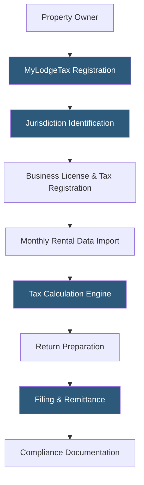

**Category:** Sales Tax & Indirect Tax
**Difficulty:** Intermediate
**Reading time:** 5 min read

---

Avalara MyLodgeTax is a lodging tax compliance platform for short-term rental property owners and vacation rental managers, automating the calculation, filing, and remittance of lodging taxes across hundreds of state and local taxing jurisdictions. It addresses the unique complexity of short-term rental tax obligations—which often involve city, county, and state taxes layered together—that differ fundamentally from standard sales tax.

- **Lodging Tax** — a tax on short-term rental accommodations, separate from sales tax, collected by state and local governments
- **Occupancy Tax** — another term for lodging tax, often used at the city or county level for hotel and vacation rental stays
- **Transient Occupancy Tax (TOT)** — the specific term used by California jurisdictions for short-term rental taxes
- **Marketplace Facilitator Collection** — Airbnb and VRBO's obligation to collect and remit lodging tax on behalf of hosts in qualifying jurisdictions
- **Self-Collected Tax** — jurisdictions where hosts (not the marketplace) must independently collect and remit lodging taxes
- **Business Registration** — the requirement to register with taxing authorities before collecting lodging taxes in a jurisdiction
- **Gross Receipts** — the taxable base for lodging tax, typically the total rental amount including cleaning fees in most jurisdictions

MyLodgeTax handles the full lodging tax compliance lifecycle for short-term rental properties. Setup begins with jurisdiction identification—based on the property's address, MyLodgeTax identifies all applicable taxing authorities: state, county, city, and special districts. In markets like New Orleans or New York City, there may be five or more overlapping lodging tax obligations for a single property.

For property owners new to compliance, MyLodgeTax assists with business registration and lodging tax permit applications in each required jurisdiction. This is often the most time-consuming step because state and local registration processes vary widely—some accept online applications, others require mailed forms.

Each month, property owners import rental data (booking dates, gross receipts, cleaning fees, guest fees) into MyLodgeTax via manual entry, CSV upload, or direct integration with platforms like Airbnb, VRBO, or property management systems. The tax calculation engine applies jurisdiction-specific rates and rules to the imported data, accounting for variations in taxable base (some jurisdictions exclude cleaning fees, others include them).

Return preparation generates the correct form for each jurisdiction, and MyLodgeTax files electronically or by mail as required by each authority. Automated payment remittance handles the tax due, and owners receive confirmation records for their files.

- Individual vacation rental owners in jurisdictions not covered by Airbnb's marketplace facilitator collection
- Short-term rental property managers with properties in multiple markets
- Investors adding short-term rental properties in new jurisdictions
- Homeowners renting property occasionally who want to ensure compliance
- Property managers seeking a single platform for multi-city compliance

| Advantage | Disadvantage |
|-----------|--------------|
| Specialized lodging tax expertise vs. generic sales tax platforms | Monthly subscription adds to rental property operating costs |
| Handles city and county registration complexity | Some local jurisdictions require manual processes outside platform coverage |
| Monitors changing lodging tax rules in covered jurisdictions | Property owners still responsible for maintaining accurate income records |
| Marketplace facilitator coverage tracking prevents double filing | Platform does not replace legal advice for complex situations |

- [Avalara AvaTax Platform](avalara-avatax-platform.md)
- [Sales Tax Filing Automation](sales-tax-filing-automation.md)
- [Multi-State Nexus Tracking](multi-state-nexus-tracking.md)

---
*Part of the [Sales Tax & Indirect Tax](index.md) category · [Back to Master Index](../../index.md)*
