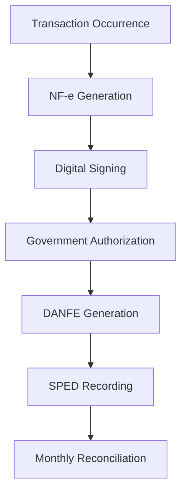

**Category:** Sales Tax & Indirect Tax
**Difficulty:** Intermediate
**Reading time:** 6 min read

---

Brazil's NF-e (Nota Fiscal Eletronica) system is a mandatory electronic invoice system for tax reporting and compliance. It integrates with government systems to track all goods and services movement across the country.

- **NF-e** — digital invoice with government authorization
- **ICMS** — interstate commerce tax at varying rates
- **IPI** — industrial products tax on manufactured goods
- **PIS/COFINS** — social contribution taxes
- **SPED** — Public Digital Bookkeeping System

The NF-e system requires all businesses to generate digital invoices for most transactions. Each invoice is submitted to the government system for authorization, receiving a unique authorization number (DANFE). The system calculates ICMS (state tax), IPI (industrial tax), and PIS/COFINS (social contributions) based on product classification and origin/destination. Transactions are recorded in the SPED (public digital bookkeeping) system, accessible to tax authorities in real-time. The system handles state-to-state transactions with ICMS rate differences and interstate commerce complexity. All invoice data feeds into monthly and annual tax compliance reporting. Digital signatures ensure invoice authenticity and non-repudiation.

- Generating compliant electronic invoices for all sales
- Managing ICMS across interstate transactions
- Calculating IPI and social contribution taxes
- Filing SPED bookkeeping with tax authorities
- Maintaining authorized invoice numbering sequences

| Advantage | Disadvantage |
|-----------|--------------|
| Real-time government visibility | Dependency on government systems |
| Reduces tax fraud | Complex tax calculation rules |
| Audit trail for all transactions | Frequent regulatory updates |
| Interstate commerce clarity | Digital signature requirements |
| Electronic bookkeeping transparency | System integration complexity |

- [India GST compliance platforms](india-gst-compliance-platforms.md)
- [Cross-border tax compliance](cross-border-tax-compliance.md)
- [Digital services tax (DST)](digital-services-tax-dst.md)

---
*Part of the [Sales Tax & Indirect Tax](sales-tax-indirect-tax/index.md) category · [Back to Master Index](../../index.md)*
