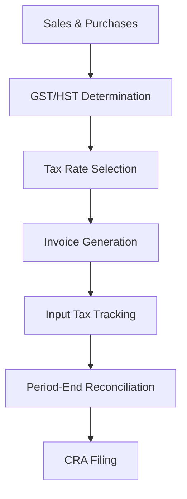

**Category:** Sales Tax & Indirect Tax
**Difficulty:** Intermediate
**Reading time:** 6 min read

---

Canada GST/HST compliance involves managing the Goods and Services Tax and Harmonized Sales Tax across provinces. The system requires registration, regular filings, and input tax credit tracking across a multi-rate environment.

- **GST (Goods and Services Tax)** — 5% federal tax on most supplies
- **HST (Harmonized Sales Tax)** — combined federal and provincial tax at 13-15%
- **PST (Provincial Sales Tax)** — provincial tax in non-HST provinces
- **Input Tax Credits (ITC)** — recovery of GST/HST paid on inputs
- **Registration Threshold** — $30,000 annual revenue requirement

Canadian sales tax operates under federal GST/HST with provincial variations. Most provinces use HST, a harmonized system combining federal and provincial tax at single rates. Businesses with annual revenue exceeding $30,000 must register and collect tax. The system tracks output tax (GST/HST collected on sales) and input tax (GST/HST paid on purchases). Registered businesses claim input tax credits, paying only the difference to the Canada Revenue Agency (CRA). Filing frequency varies from monthly to annually based on business size. The system must track supplies and acquisitions by tax category, handling zero-rated and exempt items. Detailed records support CRA audits and input tax credit claims.

- Managing GST/HST across multiple provinces
- Tracking input tax credits for business purchases
- Filing GST/HST returns with CRA
- Handling zero-rated export sales
- Managing HST-exempt transactions

| Advantage | Disadvantage |
|-----------|--------------|
| Input tax credits improve cash flow | Multiple tax rate complexity |
| Clear federal framework | Different rules by province |
| Relatively simple computation | Registration threshold management |
| Established system | Exemption classification difficult |
| Online filing available | Federal-provincial coordination needed |

- [GST (Goods and Services Tax)](gst-goods-and-services-tax.md)
- [Australia GST compliance](australia-gst-compliance.md)
- [Cross-border tax compliance](cross-border-tax-compliance.md)

---
*Part of the [Sales Tax & Indirect Tax](sales-tax-indirect-tax/index.md) category · [Back to Master Index](../../index.md)*
