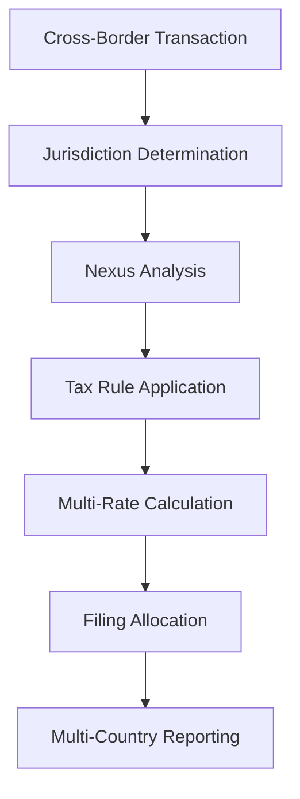

**Category:** Sales Tax & Indirect Tax
**Difficulty:** Intermediate
**Reading time:** 6 min read

---

Cross-border tax compliance involves managing sales tax, VAT, and GST obligations when selling goods or services across national boundaries. These systems determine which jurisdiction's tax rules apply and ensure proper remittance.

- **Place of Supply** — jurisdiction where supply is deemed to occur
- **Economic Nexus** — sufficient connection to jurisdiction triggering tax obligations
- **Tax Treaty** — bilateral agreements between countries affecting taxation
- **Transfer Pricing** — pricing of transactions between related entities
- **Permanent Establishment** — physical presence creating tax obligation

Cross-border tax systems determine which jurisdiction's rules apply based on transaction characteristics. For goods sales, the delivery location typically determines tax treatment. For services, complex rules consider where the customer is established, where services are performed, and where consumption occurs. The system must track economic nexus across multiple jurisdictions, determining when a business has sufficient presence to trigger registration and filing obligations. Tax treaties may provide relief from double taxation or preferential treatment. The system allocates revenue and tax liability across jurisdictions, often using apportionment formulas. Multi-country filings reconcile global transactions while following local rules.

- Selling goods across multiple countries
- Managing service delivery across borders
- Determining tax registration requirements globally
- Allocating revenue across jurisdictions
- Managing transfer pricing compliance

| Advantage | Disadvantage |
|-----------|--------------|
| Enables global commerce | Highly complex rules |
| Tax treaty benefits available | Frequent rule changes |
| Multiple jurisdiction coverage | Professional expertise required |
| Audit trail across borders | Technology integration challenging |
| Risk mitigation tools | Compliance cost significant |

- [VAT (Value Added Tax) compliance](vat-value-added-tax-compliance.md)
- [EU VAT compliance](eu-vat-compliance.md)
- [Digital services tax (DST)](digital-services-tax-dst.md)

---
*Part of the [Sales Tax & Indirect Tax](sales-tax-indirect-tax/index.md) category · [Back to Master Index](../../index.md)*
