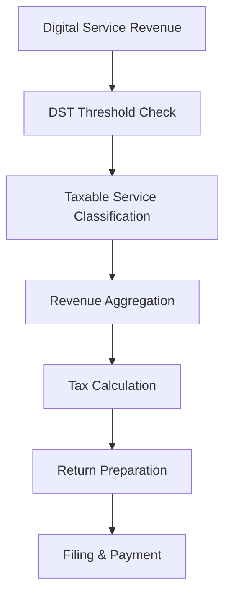

**Category:** Sales Tax & Indirect Tax
**Difficulty:** Intermediate
**Reading time:** 6 min read

---

Digital Services Tax (DST) is a supplementary tax imposed on large technology companies providing digital services. Various countries have implemented DST to capture tax revenue from digital business models that previously avoided taxation.

- **Digital Services** — online advertising, digital platforms, data services
- **Revenue Threshold** — minimum annual revenue triggering DST obligation
- **Turnover Tax** — based on gross revenue rather than profit
- **Equalization Tax** — designed to equalize taxes on digital vs. traditional commerce
- **Unilateral Implementation** — countries acting independently without international agreement

Digital Services Tax applies when a company's global revenue from specified digital services exceeds a threshold (typically 750 million euros or 25 million in a country). The tax is calculated as a percentage (usually 2-5%) of revenues from covered services including digital advertising, online marketplaces, and data sales. Unlike traditional income taxes, DST is based on gross revenue, not profit. The tax applies to services provided to consumers or businesses in the taxing country. Compliance requires identifying and aggregating qualifying revenue from global operations. Different countries have implemented varying thresholds, rates, and service definitions, requiring multi-country tracking and separate filings.

- Technology companies managing DST across multiple countries
- Tracking qualified digital service revenue globally
- Filing DST returns in multiple jurisdictions
- Planning tax strategy for digital service models
- Managing compliance with emerging DST regimes

| Advantage | Disadvantage |
|-----------|--------------|
| Captures digital economy taxes | Multiple country implementations vary |
| Reduces profit shifting | Revenue-based rather than profit-based |
| Applies to large companies | Can create double taxation |
| Revenue to governments clear | Ongoing negotiation and changes |
| Relatively simple calculation | Global revenue tracking required |

- [Cross-border tax compliance](cross-border-tax-compliance.md)
- [VAT (Value Added Tax) compliance](vat-value-added-tax-compliance.md)
- [EU VAT compliance](eu-vat-compliance.md)

---
*Part of the [Sales Tax & Indirect Tax](sales-tax-indirect-tax/index.md) category · [Back to Master Index](../../index.md)*
