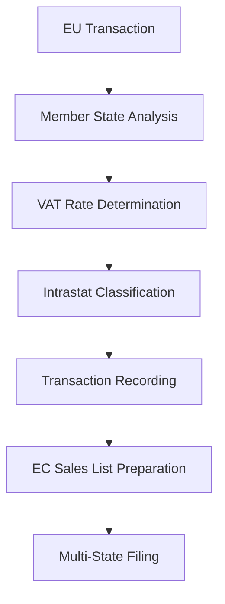

**Category:** Sales Tax & Indirect Tax
**Difficulty:** Intermediate
**Reading time:** 6 min read

---

EU VAT compliance involves navigating the complex Value Added Tax system across European Union member states. Each state has its own rules, rates, and reporting requirements, making cross-border compliance particularly challenging.

- **Member State VAT** — individual country VAT rules and rates
- **Intrastat Reporting** — reporting goods movement within EU
- **EC Sales List (ESL)** — listing of intra-community supplies
- **Reverse Charge** — mechanism shifting tax obligation to purchaser
- **VIES Registration** — VAT Information Exchange System

EU VAT compliance requires understanding multiple overlapping rules. Standard rates vary from 17% to 27% across member states, with reduced rates for specific categories. Supplies between member states trigger special rules including the reverse charge mechanism for B2B transactions. Businesses must track intra-community acquisitions and supplies separately, reporting them on the EC Sales List. Each member state requires VAT registration if certain thresholds are exceeded. The system must determine the place of supply based on complex rules depending on transaction type, customer type, and goods or services involved. Regular returns file VAT obligations with each relevant member state.

- Managing VAT across multiple EU member states
- Handling intra-community goods movements
- Applying reverse charge to B2B supplies
- Filing EC Sales Lists with authorities
- Ensuring VIES registration compliance

| Advantage | Disadvantage |
|-----------|--------------|
| Harmonized VAT system | Significant rate variations |
| Supports single market | Complex place of supply rules |
| Input VAT recovery available | Multiple registrations required |
| Audit compliance possible | Substantial documentation burden |
| Cross-border commerce facilitated | Technology integration complex |

- [VAT (Value Added Tax) compliance](vat-value-added-tax-compliance.md)
- [UK VAT Making Tax Digital (MTD)](uk-vat-making-tax-digital-mtd.md)
- [VAT OSS (One Stop Shop)](vat-oss-one-stop-shop.md)

---
*Part of the [Sales Tax & Indirect Tax](sales-tax-indirect-tax/index.md) category · [Back to Master Index](../../index.md)*
