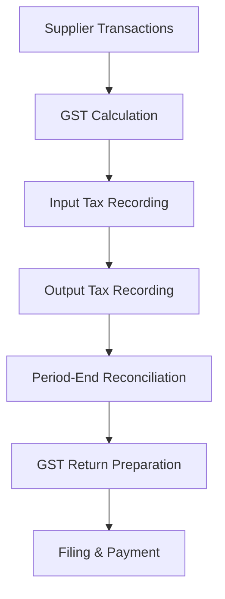

**Category:** Sales Tax & Indirect Tax
**Difficulty:** Intermediate
**Reading time:** 6 min read

---

GST (Goods and Services Tax) is a consumption tax applied across multiple stages of production and distribution. Implemented in countries like Australia, India, and Canada, GST systems involve collecting and remitting tax based on supply of goods and services.

- **Supply** — transfer of goods or services in the course of business
- **Taxable Supply** — goods and services subject to GST
- **Input Tax Credit** — GST paid on business purchases
- **GST Ledger** — record of all GST transactions
- **Tax Period** — reporting interval for GST obligations

GST operates on a self-assessment basis where businesses calculate their own GST obligations. Each supplier collects GST on sales, and each recipient claims input tax credits on purchases. Businesses file periodic GST returns showing total tax collected (output tax) less total tax paid (input tax), remitting the net amount. The system classifies supplies into taxable, exempt, or zero-rated categories based on product or service type. Some businesses register for GST above a threshold, while others remain unregistered. The GST Return typically includes schedules detailing supplies, acquisitions, and special transactions, with supporting documentation for audit purposes.

- Managing GST across import and domestic transactions
- Claiming input tax credits on business expenses
- Filing periodic GST returns with authorities
- Handling export supplies and zero-rated items
- Managing GST for different entity types

| Advantage | Disadvantage |
|-----------|--------------|
| Simplifies tax system | High compliance burden |
| Input credits improve cash flow | Registration thresholds create complexity |
| Reduces tax evasion | Extensive record-keeping required |
| Clear transaction basis | Learning curve for rate classifications |
| Broad application | Technology integration needed |

- [Canada GST/HST compliance](canada-gst-hst-compliance.md)
- [Australia GST compliance](australia-gst-compliance.md)
- [India GST compliance platforms](india-gst-compliance-platforms.md)

---
*Part of the [Sales Tax & Indirect Tax](sales-tax-indirect-tax/index.md) category · [Back to Master Index](../../index.md)*
