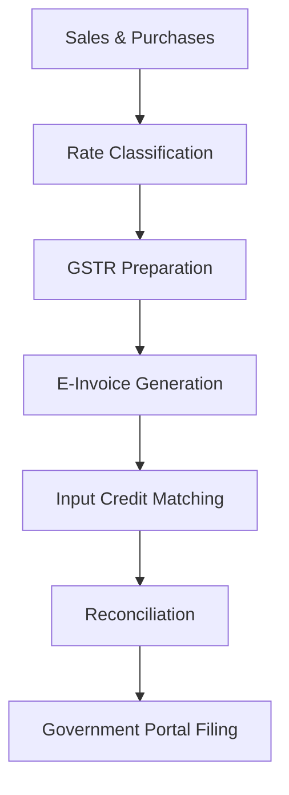

**Category:** Sales Tax & Indirect Tax
**Difficulty:** Intermediate
**Reading time:** 6 min read

---

India GST compliance platforms manage the Goods and Services Tax system implemented nationwide. These platforms handle complex multi-rate taxation, interstate supplies, and reconciliation with government GST portals.

- **GSTIN** — Goods and Services Tax Identification Number
- **Tax Rates** — multiple rates (0%, 5%, 12%, 18%, 28%) based on goods/services
- **GSTR Returns** — monthly GST return filings with various schedules
- **Input Tax Credit** — GST paid on inputs that can be credited
- **E-invoicing** — digital invoices with government system integration

India's GST platform requires businesses to maintain records by tax rate and transaction type. The system classifies supplies under multiple tax brackets (0%, 5%, 12%, 18%, 28%), each with different eligibility rules for input credit. Businesses file monthly GSTR (GST Return) forms showing sales, purchases, and input credits claimed. E-invoicing requirements mandate digital invoice generation with IRN (Invoice Reference Number) from government systems. The platform reconciles supplier invoices (GSTR-2B) with claimed input credits, blocking credits for non-matching invoices. Interstate transactions trigger additional compliance requirements. The system manages refund claims for zero-rated exports and tracks pending refunds.

- Managing multi-rate GST compliance for Indian operations
- Filing monthly GSTR returns with tax authorities
- Generating compliant e-invoices with IRN
- Tracking input credit eligibility and matching
- Managing GST on interstate supplies

| Advantage | Disadvantage |
|-----------|--------------|
| Centralized government system | Multiple tax rates increase complexity |
| E-invoicing reduces fraud | Mandatory e-invoicing required |
| Input credit transparency | Reconciliation can be tedious |
| Clear audit trail | Frequent rule changes |
| Technology-forward approach | Integration challenges with legacy systems |

- [GST (Goods and Services Tax)](gst-goods-and-services-tax.md)
- [Brazil tax compliance (NF-e)](brazil-tax-compliance-nf-e.md)
- [Cross-border tax compliance](cross-border-tax-compliance.md)

---
*Part of the [Sales Tax & Indirect Tax](sales-tax-indirect-tax/index.md) category · [Back to Master Index](../../index.md)*
