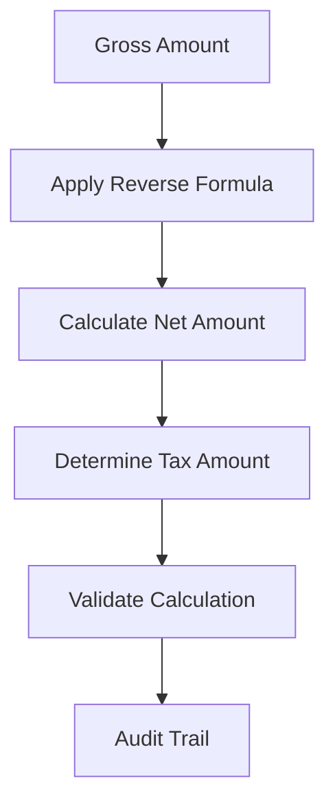

**Category:** Sales Tax & Indirect Tax
**Difficulty:** Intermediate
**Reading time:** 6 min read

---

Reverse sales tax calculation is a mathematical technique to extract the original pre-tax price from a final amount that includes sales tax. This is essential for back-calculating accurate tax amounts and validating invoices and pricing data.

- **Gross Amount** — final price including sales tax
- **Tax Rate** — percentage of sales tax applied
- **Net Amount** — original price before tax addition
- **Tax Extraction** — removing tax component from total
- **Validation** — verifying accuracy of calculated values

When only the final price including tax is known, reverse calculation extracts the original pre-tax amount and tax paid. The formula divides the total by (1 + tax rate as decimal) to get the net amount. The tax amount is then determined by subtracting the net from the gross. For example, with a 8% tax rate, dividing a $108 total by 1.08 yields a $100 net price and $8 tax. Systems handling reverse calculations must account for rounding rules, multiple tax jurisdictions, and special tax scenarios. Accuracy is critical for audit purposes, as small rounding differences across thousands of transactions can accumulate significantly.

- Converting gross invoices to tax-separated amounts
- Validating tax calculations in received bills
- Extracting tax components for cost allocation
- Reconciling sales reported on multiple documents
- Converting pricing formats between tax-inclusive and exclusive

| Advantage | Disadvantage |
|-----------|--------------|
| Recovers tax data from totals | Rounding precision issues |
| Validates calculations | Cannot recover deleted tax info |
| Supports cost allocation | Multi-rate scenarios complex |
| Audit documentation | Formula must be jurisdiction-correct |
| Quick computation | Data entry errors propagate |

- [Sales tax rate databases](sales-tax-rate-databases.md)
- [Use tax compliance](use-tax-compliance.md)
- [Sales tax filing automation](sales-tax-filing-automation.md)

---
*Part of the [Sales Tax & Indirect Tax](sales-tax-indirect-tax/index.md) category · [Back to Master Index](../../index.md)*
